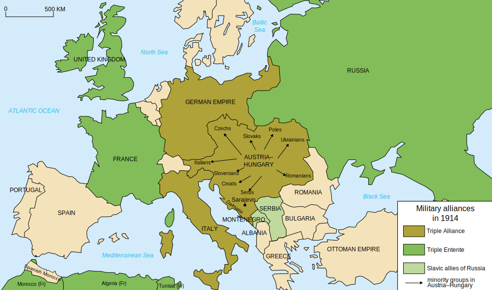
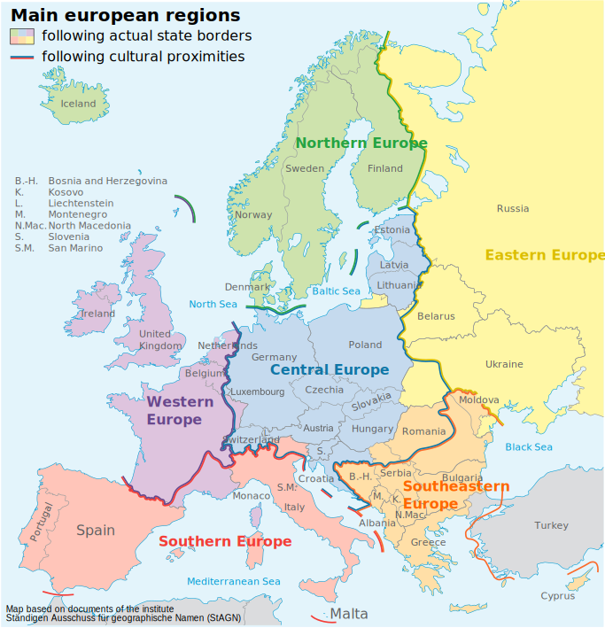
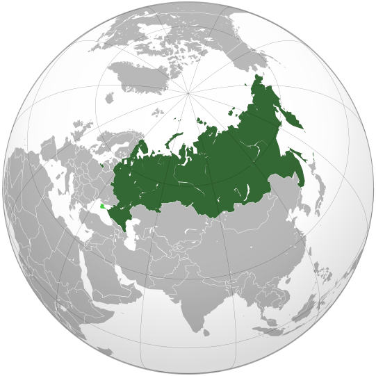
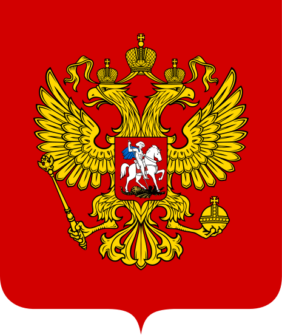
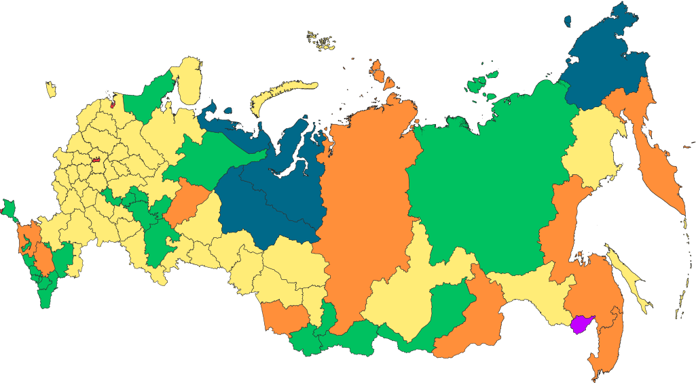
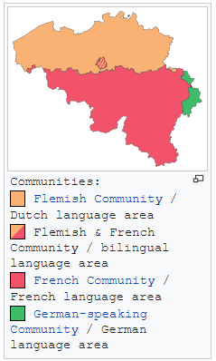
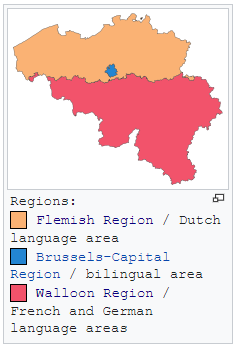

# 第一次世界大战

<table><tr>
    <td>

 1914年欧洲主要国家

</td>
    <td>

 2020欧洲大陆主要国家

</td>
</tr></table>

战争主要经过：

1. 1914.6 萨拉热窝事件:奥匈帝国皇储斐迪南大公，在波斯尼亚-黑塞哥韦那地区首府萨拉热窝，遭到塞尔维亚青年刺杀。-->
2. 1914.8 德军首先占领比利时，然后入侵法国，兵临巴黎城下。德军在马恩河遭到阻击，德军“速战速决”战略(“施里芬”计划)破产。年底战线形成对峙局面：东线(德军vs俄军in波罗的海南岸至罗马尼亚)、西线(德军vs英法联军in比利时、法国北部和德法边境)、南线(奥匈军队vs塞尔维亚军队in巴尔干半岛)。-->
3. 1916.2-1916.12 凡尔登战役：双方伤亡人数达70万。出现新式武器：毛瑟步枪和马克沁机器。-->
4. 1916.5 日德兰海战：英海军vs德海军，战后英军仍掌握制海权。-->
5. 1916.6-1916.11 索姆河战役：英法联军为了牵制德军，在法国北部索姆河发动战役，双方伤亡人数达130万。出现新式武器：英军坦克。-->
6. 1917.4 美国加入协约国集团，对德国宣战。-->
7. 1917.11 俄国爆发“十月革命”，资产阶级临时政府被推翻，建立苏维埃政府，向各国建议停战。-->
8. 1918.3 苏俄与同盟国签定《布列斯特合约》，退出一战。-->
9. 1918.3-1918.7 德军发动最后四次大规模进攻，协约国进行第一次大规模反攻，战线推进至马恩河一带-->
10. 1918.9-1918.10 协约国突破德国在德法边境的“兴登堡防线”，同盟国集团开始瓦解。-->
11. 1918.11.9 德国柏林工人起义，德皇威廉二世宣布退位，逃亡荷兰。-->
12. 1918.11.11 德国与协约国在法国巴黎郊外的一节火车厢(福煦车厢)签定停战协定。

## 俄罗斯

俄罗斯(Russia)首都是莫斯科(Moscow)。现在是一个联邦制总统制宪政共和国(Federal semi-presidential constitutional republic)。

<table><tr>
    <td>

 俄罗斯位置

</td>
    <td>

        
        
俄罗斯国旗

        
        
俄罗斯盾徽

    
</td>
</tr></table>

现在俄罗斯有46个州(46 oblasts)、1个自治州(1 autonomous oblast: **Jewish Autonomous Oblast** )、3个联邦直辖市(3 federal cities)、4个自治区(4 autonomous okrugs)、9个边疆区(9 krais)、22个共和国(22 republics)。

    

        
        
俄罗斯行政区域划分

    

## 德国

德国(Germany)首都是柏林()。

## 比利时

比利时(Belgium)首都是布鲁塞尔(Brussels)。现在是一个联邦制议会制君主立宪制国家(Federal parliamentary constitutional monarchy)。

<table><tr>
    <td>

比利时

</td>
    <td>

    
比利时国旗

    
    
比利时盾徽

    
</td>
</tr></table>

现在比利时主要分为三个区域：弗拉芒区(Flemish Region)、瓦隆区(Walloon Region)和布鲁塞尔首都地区(Brussels Capital Region)。根据语言主要分为三个社区：荷兰语社区、法语社区和德语社区。

<table><tr>
    <td>
					
Communities
			
    
</td>
    <td>

    
Regions

    
</td>
</tr></table>

