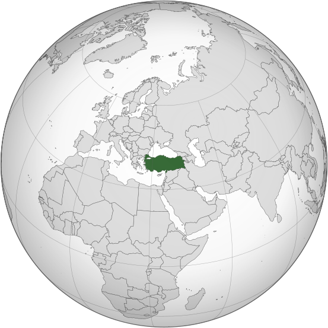

# 第一次世界大战

<table><tr>
    <td>

 1914年欧洲主要国家

</td>
    <td>

 2020欧洲大陆主要国家

</td>
</tr></table>

战争主要经过：

1. 1914.6 萨拉热窝事件:奥匈帝国(Austro-Hungarian)皇储斐迪南大公，在波斯尼亚-黑塞哥韦那地区首府萨拉热窝，遭到塞尔维亚青年刺杀。-->
2. 1914.8 德军首先占领比利时，然后入侵法国，兵临巴黎城下。德军在马恩河([Marne River](https://en.wikipedia.org/wiki/First_Battle_of_the_Marne))遭到阻击，德军“速战速决”战略(“施里芬”计划)破产。年底战线形成对峙局面：东线(德军vs俄军in波罗的海南岸至罗马尼亚)、西线(德军vs英法联军in比利时、法国北部和德法边境)、南线(奥匈军队vs塞尔维亚军队in巴尔干半岛)。-->
3. 1916.2-1916.12 凡尔登战役：双方伤亡人数达70万。**出现新式武器：毛瑟步枪和马克沁机器。**-->
4. 1916.5 日德兰海战：英海军vs德海军，战后英军仍掌握制海权。-->
5. 1916.6-1916.11 索姆河战役：英法联军为了牵制德军，在法国北部索姆河发动战役，双方伤亡人数达130万。出现新式武器：英军坦克。-->
6. 1917.4 美国加入协约国集团，对德国宣战。-->
7. 1917.11 俄国爆发“十月革命”，资产阶级临时政府被推翻，建立苏维埃政府，向各国建议停战。-->
8. 1918.3 苏俄与同盟国签定《布列斯特合约》([Treaty of Brest-Litovsk](https://en.wikipedia.org/wiki/Treaty_of_Brest-Litovsk))，退出一战。-->
9. 1918.3-1918.7 德军发动最后四次大规模进攻，协约国进行第一次大规模反攻，战线推进至马恩河一带-->
10. 1918.9-1918.10 协约国突破德国在德法边境的“兴登堡防线”，同盟国集团开始瓦解。-->
11. 1918.11.9 德国柏林工人起义，德皇威廉二世宣布退位，逃亡荷兰。-->
12. 1918.11.11 德国与协约国在法国巴黎郊外的一节火车厢([福煦车厢](https://en.wikipedia.org/wiki/Ferdinand_Foch))签定停战协定。

## 军事同盟

协约国(Entente Powers)：英国、法国、美国(1917年加入)、俄国、<u>意大利</u>、日本

同盟国(Central Power)：德意志帝国、奥匈帝国、<u>意大利</u>、奥斯曼帝国(Ottoman Empire)、保加利亚(Bulgaria)

## 凡尔赛-华盛顿体系

### 凡尔赛体系

一战期间和一战后，协约国集团主要国家和同盟国集团部分国家发生一系列政治体制变革，主要有：

1. 德意志帝国崩溃-->1918.11.9 建立魏玛共和国(Weimar Republic)，是一个联邦制宪政共和国(federal constitutional republic)；
2. 奥匈帝国(Austro-Hungarian Empire)分解为三个部分：奥地利、匈牙利和捷克斯洛伐克；
3. 奥斯曼帝国崩溃-->1923 凯末尔领导土耳其人民革命，建立土耳其共和国(Republic of Turkey)，是一个议会制共和国(parliamentary republic)；
4. 俄罗斯帝国崩溃(Russia Monarchy)-->1917.2 俄国资产阶级临时政府(Provisional Government)-->1917.11 俄国"十月革命"， 建立苏维埃政府(Soviet Socialist Republic)。

1919.6.28 协约国集团在法国凡尔赛宫签定《凡尔赛合约》([Treaty of Versailles/Treaty of Peace between the Allied and Associated Powers and Germany](https://en.wikipedia.org/wiki/Treaty_of_Versailles))，对德国进行制裁，主要内容：

1. 重新划定德国疆界。西部，比利时拥有莫里斯尼特([Moresnet](https://en.wikipedia.org/wiki/Moresnet))和([Eupen-Malmedy](https://en.wikipedia.org/wiki/Eupen-Malmedy))主权，6个月后公民投票归属于比利时还是德国；阿尔萨斯-洛林([Alsace-Lorraine](https://en.wikipedia.org/wiki/Alsace-Lorraine))归还给法国；萨尔煤矿由法国开采15年，15年后公民投票决定其归属；莱茵河西岸领土协约国占领15年。南部，德国承认奥地利、捷克斯洛伐克独立。东部，德国承认波兰独立，将波兹南(Posen/[Poznań](https://en.wikipedia.org/wiki/Poznań))一部分领土划给波兰；东普鲁士同德国本部之间划出一道“波兰走廊”([Polish Corridor](https://en.wikipedia.org/wiki/Polish_Corridor))，作为波兰出海口；但泽交由波兰管理；放弃《布列斯特合约》所获领土。
2. 德国放弃全部海外殖民地，由战胜国“委任统治”方式进行瓜分，德国在中国山东权益移交给日本。
3. 军事方面，限制德国军备，不得实行普遍义务兵制；陆军人员数量不得超过10万；不得拥有飞机和潜水艇，只允许拥有轻型舰艇；莱茵河东岸50公里，不得设防。
4. 战争赔款，由赔偿委员会确定赔偿总额和赔偿方式，并承担占领军全部费用。

<table><tr>
	<td>

    	
    	
一战后德国损失的领土

    
</td>
    <td>

        
        
波兰走廊

    
</td>
</tr></table>

巴黎和会上提出建立国际联盟([League of Nations:1920-1946](https://en.wikipedia.org/wiki/League_of_Nations))，总部设立在瑞士日内瓦。《凡尔赛合约》签定后，战胜国集团与其他战败国签定了一系列条约，构成凡尔赛体系：

1. 1919.9.11 协约国与奥地利签定《圣日耳曼条约》
2. 1919.11.27 协约国与保加利亚签定《纳依条约》
3. 1920.6.4 协约国与匈牙利签定《特里亚农条约》
4. 1920.8.10 协约国与土耳其素丹政府签定《色佛儿条约》-->土耳其青年党领袖凯末尔领导新政府打败英国支持的素丹政府和入侵的希腊军队-->1923.7.24 签定《洛桑条约》

### 华盛顿体系

华盛顿会议是巴黎和会的继续，实际上这次会议的召开让美国获取了在东亚和太平洋区域的权益。主要内容有：

1. 签定《四国条约》，规定缔约国互相尊重在太平洋区域内岛屿属地和领地的权利。(实际上，美国拆散了自日俄战争以来的英日同盟；日本第一次处于同欧美列强同等地位，在太平洋地区和亚洲东部地区权益得到列强认可。)

2. 限制海军军备竞赛，规定英、美、日、法和意海军主力舰和航空母舰总吨位最大限额。(美国外交上的胜利，使得英国承认美海军与英海军具有同等地位；美、英在靠近日本海军基地方面作出让步)

   |      |  主力舰  | 航空母舰 |
   | :--: | :------: | :------: |
   |  美  | 52.5万吨 | 13.5万吨 |
   |  英  | 52.5万吨 | 13.5万吨 |
   |  日  | 31.5万吨 | 8.1万吨  |
   |  法  | 17.5万吨 |  6万吨   |
   |  意  | 17.5万吨 |  6万吨   |

3. 关于中国问题，签定《九国公约》，规定在华“门户开放”、“机会均等”，实际上该条约打破日本对中国的独占，帮助美国攫取在华权益。

# 第二次世界大战

# 欧洲主要国家

## 俄罗斯

俄罗斯(Russia)首都是莫斯科(Moscow)。现在是一个联邦制总统制宪政共和国(Federal semi-presidential constitutional republic)。俄罗斯1990年由苏联解体而来，政体由社会主义制度变为资本主义制度。

<table>
    <td>

 俄罗斯位置

</td>
    <td>

        
        
俄罗斯国旗

        
        
俄罗斯国徽

    
</td>
</table>

现在俄罗斯有46个州(46 oblasts)、1个自治州(1 autonomous oblast: **Jewish Autonomous Oblast** )、3个联邦直辖市(3 federal cities)、4个自治区(4 autonomous okrugs)、9个边疆区(9 krais)、22个共和国(22 republics)。

    

        
    

## 德国

德国(Germany)首都是柏林。

## 比利时

比利时(Belgium)首都是布鲁塞尔(Brussels)。现在，比利时是一个联邦制议会制君主立宪制国家(Federal parliamentary constitutional monarchy)。

<table>
    <td>

比利时

</td>
    <td>

    
比利时国旗

    
    
比利时国徽

    
</td>
</table>

比利时主要分为三个区域：弗拉芒区(Flemish Region)、瓦隆区(Walloon Region)和布鲁塞尔首都地区(Brussels Capital Region)。根据语言主要分为三个社区：荷兰语社区、法语社区和德语社区。

<table><tr>
    <td>
					
Communities
			
    
</td>
    <td>

    
Regions

    
</td>
</tr></table>

## 土耳其

土耳其(Turkey)横跨欧亚大陆，首都是安卡拉(Ankara)，最大城市是伊斯坦布尔(Istanbul)。现在的政体是一个联邦制议会制共和国。

<table>
    <td>

        
        
土耳其地理位置

    
</td>
    <td>

        
        
土耳其国旗

        
        
奥斯曼帝国国徽

    
</td>   
</table>

第一次世界大战后，奥斯曼帝国覆灭。1923年，凯末尔([Mustafa Kemal Atatürk](https://en.wikipedia.org/wiki/Mustafa_Kemal_Atatürk))领导土耳其革命，建立土耳其共和国，延续至今。土耳其国内宗教信仰自由，国内主要信仰伊斯兰教。

