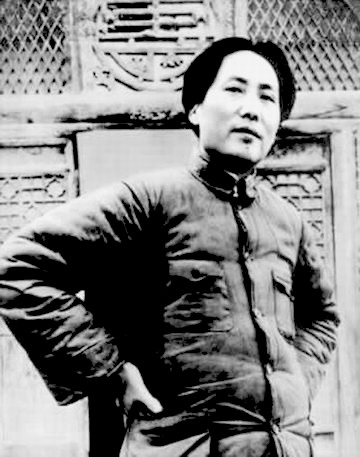

**实力永远是维护正义的基础，国防永远是外交坚实的保障。尊严只在剑锋之上，真理只在大炮射程之内。**

# 江泽民

## 《七律·园竹》

小园静静碧湖边，阅尽沧桑数百年。夏响青篁冬悦雪，昼巡红镜夜观天。

民生最念狂风后，世事常思细雨前。把卷南窗桑梓月，鞠躬尽瘁为苍黔。

# 毛泽东

## 《沁园春·长沙》1925

独立寒秋，湘江北去，橘子洲头。看万山红遍，层林尽染，漫江碧透，百舸争流。鹰击长空，🐟鱼翔浅底，万类霜天竞自由。怅寥廓，问苍茫大地，谁主沉浮？

携来百侣曾游。忆往昔峥嵘岁月稠。恰同学少年，风化正茂，书生意气，挥斥方遒。指点江山，激扬文字，粪土当年万户侯。曾记否，到中流击水，浪遏飞舟？

## 《采桑子·重阳》1929

人生易老天难老，岁岁重阳。今又重阳，战地黄花分外香。

一年一度秋风劲，不似春光。胜似春光，寥廓江天万里霜。

## 《忆秦娥·娄山关》1935.2

西风烈，长空雁叫霜晨月。霜晨月，马蹄声碎，喇叭声咽。

雄关漫道真如铁，而今迈步从头越。从头越，苍山如海，残阳如血。

## 《清平乐·六盘山》1935.10

天高云淡，望断南飞燕。不到长城非好汉，屈指行程二万。

六盘山上高峰，红旗漫卷西风。今日长缨在手，何时缚住苍龙？

## 《沁园春·雪》1936

**written on 1936/published on 1945.11.14**

北国风光，千里冰封，万里雪飘。望长城内外，惟余莽莽。大河上下，顿失滔滔。山舞银蛇，原驰蜡像，欲与天公试比高。须晴日，看红装素裹，分外妖娆。

江山如此多娇，引无数英雄竞折腰。惜秦皇汉武，略输文采；唐宗宋祖，稍逊风骚。一代天骄，成吉思汗，只识弯弓射大雕。俱往矣，数风流人物，还看今朝。

## 《七律·人民解放军占领南京》1949.9

钟山风雨起苍黄，百万雄狮过大江。

虎踞龙盘今胜昔，天翻地覆慨而慷。

宜将胜勇追穷寇，不可沽名学霸王。

天若有情天亦老，人间正道是沧桑。

## 《水调歌头·游泳》1956.6

才饮长沙水，又食武昌鱼🐟。万里长江横渡，极目楚天舒。不管风吹浪打，胜似闲庭信步，今日得宽馀。子在川上曰：逝者如斯夫！

风樯动，龟蛇静，起宏图。一桥飞架南北，天堑变通途。更立西江石壁，截断巫山云雨，高峡出平湖。神女应无恙，当惊世界殊。

## 《满江红·和郭沫若同志》1963年春

小小寰宇，有几个苍蝇碰壁。几声凄厉，几声抽泣。蚂蚁缘槐夸大国，蚍蜉撼树谈何易。正西风落叶下长安，飞鸣镝。

多少事，从来急。天地转，光阴迫。一万年太久，只争朝夕。四海翻腾云水怒，五洲震荡风雷激。要扫除一切害人虫，全无敌。

## 《贺新郎·读史》1964年春

人猿相揖别，只几个石头磨过，小儿时节。铜铁炉中翻火焰，为问何时猜得？不过几千寒热。人世难逢开口笑，上疆场彼此弯工月。流遍了，郊原血。

一篇读罢头飞雪，但记得斑斑点点，几行陈迹。五帝三皇神圣事，骗了无涯过客。有多少风流人物？盗跖庄蹻流誉后，更陈王奋起挥黄钺。歌未竟，东方白。

## 《水调歌头·重上井冈上》1965.5

久有凌云志，重上井冈山。千里来寻故地，旧貌变新颜。到处莺歌燕舞，更有潺潺流水，高路入云端。过了黄洋界，险处不须看。

风雷动，旌旗胜，是人寰。三十八年过去，弹指一挥间。上可九天揽月，下可五洋捉鳖，谈笑凯歌还。世上无难事，只要肯攀登。

## 《念奴娇·鸟儿问答》1965年秋

鲲鹏展翅，九万里，翻动扶摇羊角。背负青天朝下看，都是人间城郭。炮火连天，弹痕遍地，吓到蓬间雀。怎么得了，哎呀我要飞跃。

借问君去何方，雀儿答道：有仙山琼阁。不见前年秋月朗，顶了三家条约。还有吃的，土豆烧熟了，再加牛肉。不须放屁！试看天地翻覆。

# 陈亮

## 《念奴娇·登多景楼》

危楼还望，叹此意、今古几人曾会？鬼设神施，浑认作、天限南疆。一水横陈，连岗三面，做出争雄势。六朝何事，只成门户私计！

因笑王谢诸人，登高怀远，也学英雄涕。凭却长江，管不到，河洛膻腥无际。正好长驱，不须反顾，寻取中流誓。小儿破贼，势成宁问强对。

# 曹植

## 《洛神赋》

