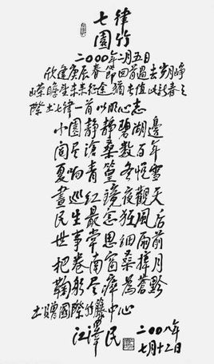
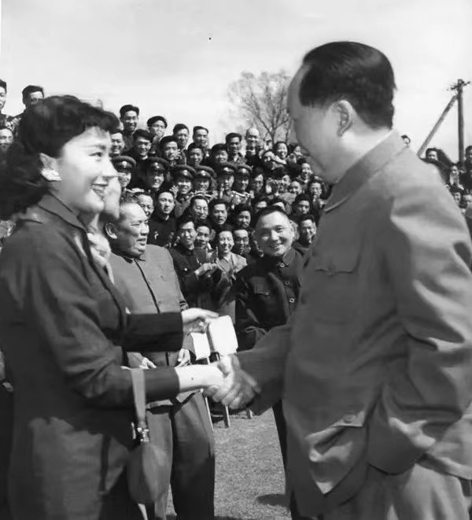

# 江泽民
## 《七律·园竹》

小园静静碧湖边，阅尽沧桑数百年。夏响青篁冬悦雪，昼巡红镜夜观天。

民生最念狂风后，世事常思细雨前。把卷南窗桑梓月，鞠躬尽瘁为苍黔。

# 毛泽东
## 《水调歌头·重上井冈上》

久有凌云志，重上井冈山。千里来寻故地，旧貌变新颜。到处莺歌燕舞，更有潺潺流水，高路入云端。过了黄洋界，险处不须看。

风雷动，旌旗胜，是人寰。三十八年过去，弹指一挥间。上可九天揽月，下可五洋捉鳖，谈笑凯歌还。世上无难事，只要肯攀登。

# 曹植

## 《洛神赋》

