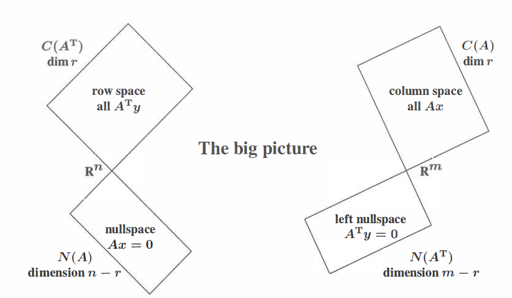
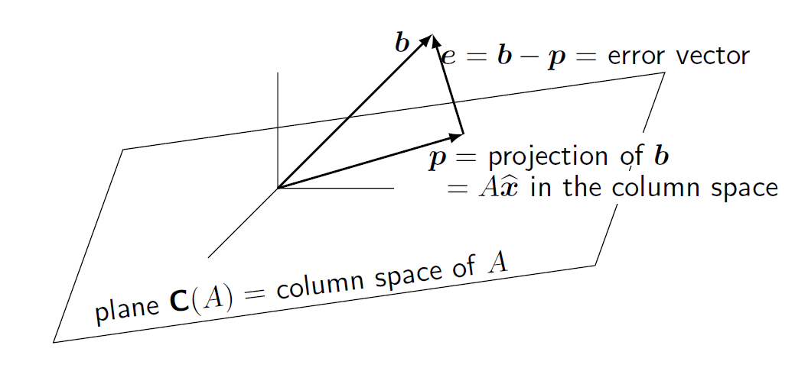
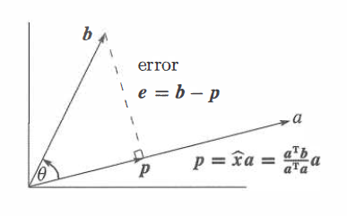
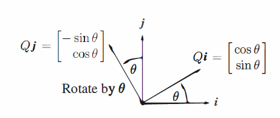

# 矩阵乘法

# 向量空间

## 子空间

矩阵的四个基本子空间(subspace)：行空间(row space)、列空间(column space)、零空间(null space)、左零空间(left null space)。

- **行空间：矩阵行向量组成的线性空间，记为$C(A^T)$​​；**
- **列空间：矩阵列向量组成的线性空间，记为$C(A)$；**
- **零空间：表达式$Ax=0$​的解向量组成的线性空间，记为$N(A)$​；**
- **左零空间：表达式$A^Tx=0$​​​的解向量组成的线性空间，记为$N(A^T)$​​​​​​​。**

当$m\times n$​阶矩阵A的秩$rank(A)=r$​,可以通过高斯消元法得到：
$$
\begin{aligned}
A\vec x=\boldsymbol 0 &\rArr
\left[\begin{matrix}
I&F\\
\bold 0&\bold 0
\end{matrix}\right]
\vec x=\bold 0 

\\&\rArr \vec x=
\left[\begin{matrix}
-F\\I  
\end{matrix}\right]
\end{aligned}
$$

矩阵的行空间与零空间的维数之和为矩阵的列数$n$​​，并且两个子空间相互正交:
$$
dim(C(A^T))+dim(N(A))=n\\
C(A^T)\cdot N(A)=0
$$
矩阵的列空间与左零空间维数之和为矩阵的行数$m$，并且两个子空间相互正交：
$$
dim(C(A))+dim(N(A^T))=m\\
C(A)\cdot N(A^T)=0
$$

<iframe src=https://www.bilibili.com/video/BV1bb411H7JN?p=16
        name="超赞的线性代数讲义"
        class="iframe"
        width=100% 
        height=600px
        scrolling="auto"
        sandbox="allow-scripts allow-forms allow-same-origin">
</iframe>

## 投影矩阵

向量投影变换是指向量在矩阵列空间上的投影，记投影变换矩阵为$P$​​​​​​，即投影变换为:$\boldsymbol b\rightarrow P\boldsymbol b$​​​​​​。记向量$\boldsymbol b$​​​​​​在矩阵$A$​​​​​​的列空间上的投影为$\boldsymbol p$​​​​​​，那么二者的差向量$\boldsymbol b-\boldsymbol p$​​​​​​就应当垂直于投影$\boldsymbol p$​​​​​​​(投影的定义，这样保证投影向量是“最小的”)，所以就有表达式：
$$
\boldsymbol p\cdot(\boldsymbol b-\boldsymbol p)=\boldsymbol 0
\Rightarrow (P\boldsymbol b)^T\cdot(\boldsymbol b-P\boldsymbol b)=\boldsymbol 0
$$

显然从上面的表达式中无法求得$P$​​，再补充一条件，投影$\boldsymbol p$​​在矩阵的矩阵$A$​​的列空间上(投影$\boldsymbol p$​​可以由矩阵$A$​​的列向量线性组合而来)，即满足：
$$
\boldsymbol p=A\hat{\boldsymbol x}
$$
代入式中，然后我们就能够得到：
$$
A^T(\boldsymbol b-A\hat{\boldsymbol x})=\boldsymbol 0
\Rightarrow A^T A\hat{\boldsymbol x}=A^T\boldsymbol b
$$

实际上我们可以这么来理解：差向量$\boldsymbol e=\boldsymbol b-\boldsymbol p=\boldsymbol b-A\hat{\boldsymbol x}$​垂直于矩阵$A$​的列空间，就可以直接得到上式。当矩阵$A$​的列线性无关时，对上面的表达式化简，我们就可以得到投影变换为：
$$
\boldsymbol p=A(A^T A)^{-1}A^T\boldsymbol b
$$
其中，矩阵$P=A(A^T A)^{-1}A^T$​就是投影矩阵。显然，当矩阵的列空间是一条直线时，也是满足投影变换的，这时候我们就有：
$$
\boldsymbol p=\boldsymbol a\hat x=\frac{\boldsymbol a\boldsymbol a^T}{\boldsymbol a^T\boldsymbol a}\boldsymbol b
$$

实际应用中，利用矩阵乘法和向量数乘性质，能够较快地得到向量投影计算式：
$$
\boldsymbol p=\frac{\boldsymbol a\boldsymbol a^T}{\boldsymbol a^T\boldsymbol a}\boldsymbol b=\boldsymbol a\frac{\boldsymbol a^T\boldsymbol b}{\boldsymbol a^T\boldsymbol a}=\hat x\boldsymbol a
$$

## 旋转矩阵

记平面向量关于坐标原点旋转$\theta$​角后的旋转变换为：$\boldsymbol b\rightarrow Q\boldsymbol b$​​​。

取坐标系下一组单位基：$\boldsymbol u=[1,0]^T$​​和$\boldsymbol v=[0,1]^T$​​，很容易得到旋转之后在原坐标系下变为：$\boldsymbol u'=[\cos\theta,\sin\theta]^T$​​和$\boldsymbol v=[-\sin\theta,\cos\theta]^T$​。设旋转矩阵为$Q$，那么，就有：​​​​
$$
Q\left[\begin{matrix}
\boldsymbol u&\boldsymbol v
\end{matrix}\right]
=\left[\begin{matrix}
\boldsymbol u'&\boldsymbol v'
\end{matrix}\right]\Rightarrow
Q\left[\begin{matrix}
1&0\\
0&1
\end{matrix}\right]=
\left[\begin{matrix}
\cos\theta&-\sin\theta\\
\sin\theta&\cos\theta
\end{matrix}\right]
$$
即可求矩阵$Q$​得表达式为：

$$
Q=\left[\begin{matrix}
\cos\theta&-\sin\theta\\
\sin\theta&\cos\theta
\end{matrix}\right]
$$

相似地，在三维空间中我们可以得到，绕$x$轴旋转$\alpha$角的旋转矩阵为：
$$
Q_{\alpha}=\left[\begin{matrix}
1&0&0\\
0&\cos\alpha&-\sin\alpha\\
0&\sin\alpha&\cos\alpha
\end{matrix}\right]
$$
绕$y$​轴旋转$\beta$​角的旋转矩阵为：
$$
Q_{\beta}=\left[\begin{matrix}
\cos\beta&0&\sin\beta\\
0&1&0\\
-\sin\beta&0&\cos\beta
\end{matrix}\right]
$$
绕$z$​​轴旋转$\gamma$​​​角的旋转矩阵为：
$$
Q_{\gamma}=\left[\begin{matrix}
\cos\gamma&-\sin\gamma&0\\
\sin\gamma&\cos\gamma&0\\
0&0&1
\end{matrix}\right]
$$
那么三维空间中旋转矩阵可以表示为：
$$
Q=Q_{\alpha}Q_{\beta}Q_{\gamma}
$$

## 反射矩阵

记向量关于直线$l$​​​​​​反射变换矩阵为$P$​​​​​​，即反射变换为：$\boldsymbol b\rightarrow P\boldsymbol b$​​​​​​。取直线$l$​​​​​​上单位方向向量$\boldsymbol u=[\cos\theta,\sin\theta]^T$​​​​​​和垂直于直线的单位法向向量$\boldsymbol v=[\sin\theta,-\cos\theta]^T$​​​​​​作为一组基，关于直线$l$​​​​​​对称后的基为$\boldsymbol u'=\boldsymbol u=[\cos\theta,\sin\theta]^T$​​​​​​和$\boldsymbol v'=-\boldsymbol v=[-\sin\theta,\cos\theta]^T$​​​​​​​。就有表达式：
$$
\begin{aligned}
P\left[\begin{matrix}
\boldsymbol u&\boldsymbol v
\end{matrix}\right]=
\left[\begin{matrix}
\boldsymbol u'&\boldsymbol v'
\end{matrix}\right]&\Rightarrow
P\left[\begin{matrix}
\cos\theta&\sin\theta\\
\sin\theta&-\cos\theta\\
\end{matrix}\right]=
\left[\begin{matrix}
\cos\theta&-\sin\theta\\
\sin\theta&\cos\theta\\
\end{matrix}\right]
\\&\Rightarrow
P=\left[\begin{matrix}\cos2\theta&\sin2\theta\\\sin2\theta&-\cos2\theta\end{matrix}\right]
\end{aligned}
$$
那么，平面坐标系下关于直线对称的矩阵变换是：
$$
\begin{bmatrix}
x'\\y'
\end{bmatrix}
=\begin{bmatrix}
\cos2\theta&\sin2\theta\\
\sin2\theta&-\cos2\theta
\end{bmatrix}
\begin{bmatrix}
x\\y
\end{bmatrix}
$$
$P=\begin{bmatrix}\cos2\theta&\sin2\theta\\\sin2\theta&-\cos2\theta\end{bmatrix}$​​​​​​​​也是一个正交矩阵​，满足：(1)$P^{-1}=P^{T}$​​​​​，​(2)$P^2=I$​

## 格拉姆-施密特正交化

格拉姆-施密特正交化(Gram-Schmidt)方法一般用于一组标准规范基的构造，原理主要是利用原向量与投影向量的差向量正交于投影向量的性质。设有$n$​​​个线性无关的向量：$\boldsymbol a_{1},\boldsymbol a_{2},\cdots,\boldsymbol a_{n}$​​​，通过正交化方法最后形成一组标准规范基：$\boldsymbol q_{1},\boldsymbol q_{2},\cdots,\boldsymbol q_{n}$​​​。其正交化过程可以表述为：

- step1:选取第一个元素，进行标准化​

$$
\boldsymbol q_{1}=\frac{\boldsymbol a_{1}}{\Vert\boldsymbol a_{1}\Vert}
$$

- step2:对第二个元素进行正交化，并且标准化
$$
\begin{cases}
\boldsymbol q_{2}=\boldsymbol a_{2}-\frac{\boldsymbol q_{1}\boldsymbol q_{1}^T}{\boldsymbol q_{1}^T\boldsymbol q_{1}}\boldsymbol a_{2}\\
\boldsymbol q_{2}=\frac{\boldsymbol q_{2}}{\Vert\boldsymbol q_{2}\Vert}
\end{cases}
$$

- step3:利用投影矩阵的性质，对第三个元素进行正交化和标准化

$$
\begin{cases}
\boldsymbol q_{3}=\boldsymbol a_{3}-\frac{\boldsymbol q_{1}\boldsymbol q_{1}^T}{\boldsymbol q_{1}^T\boldsymbol q_{1}}\boldsymbol a_{3}-\frac{\boldsymbol q_{2}\boldsymbol q_{2}^T}{\boldsymbol q_{2}^T\boldsymbol q_{2}}\boldsymbol a_{3}\\
\boldsymbol q_{3}=\frac{\boldsymbol q_{3}}{\Vert\boldsymbol q_{3}\Vert}
\end{cases}
$$

- ...
- step n:依次类推，可以得到第$n$​​个规范基的表达式：

$$
\begin{cases}
\boldsymbol q_{n}=\boldsymbol a_{n}-\frac{\boldsymbol q_{1}\boldsymbol q_{1}^T}{\boldsymbol q_{1}^T\boldsymbol q_{1}}\boldsymbol a_{n}-\frac{\boldsymbol q_{2}\boldsymbol q_{2}^T}{\boldsymbol q_{2}^T\boldsymbol q_{2}}\boldsymbol a_{n}-\cdots-\frac{\boldsymbol q_{n-1}\boldsymbol q_{n-1}^T}{\boldsymbol q_{n-1}^T\boldsymbol q_{n-1}}\boldsymbol a_{n}\\
\boldsymbol q_{n}=\frac{\boldsymbol q_{n}}{\Vert\boldsymbol q_{n}\Vert}
\end{cases}
$$

将正交化结果用矩阵形式表示，就有：
$$
A=QQ^TA=Q(Q^TA)=QR
$$

即有下式：
$$
\begin{bmatrix}
\\
\boldsymbol a_1&\boldsymbol a_2&\cdots&\boldsymbol a_n\\
\\
\end{bmatrix}=
\begin{bmatrix}
\\
\boldsymbol q_1&\boldsymbol q_2&\cdots&\boldsymbol q_n\\
\\
\end{bmatrix}
\begin{bmatrix}
\boldsymbol q_{1}^T\boldsymbol a_{1}&\boldsymbol q_{1}^T\boldsymbol a_{2}&\cdots&\boldsymbol q_{1}^T\boldsymbol a_{n}\\
&\boldsymbol q_{2}^T\boldsymbol a_{2}&\cdots&\boldsymbol q_{2}^T\boldsymbol a_{n}\\
&&\ddots&\vdots\\
&&&\boldsymbol q_{n}^{T}\boldsymbol a_{n}
\end{bmatrix}
$$

上面的表达式就是我们通常意义上所说的QR分解，即$A=QR$​。​

## 最小二乘法

最小二乘法(least squares approximation)在统计学和工程计算中占有重要的地位，通过最小化误差来进行数据拟合。实际中，输入数据本身是存在误差的，精确解通常是无法得到的。一般情况下，对多组输入数据，我们可以得到一个矩阵方程：
$$
Ax=\boldsymbol b
$$
当方程数量大于未知数数量时（系数矩阵$A$​的行数大于列数：$m>n$​），原方程不一定存在解，这个时候最小二乘法就能求得一个近似解$\hat x$​，某种程度上其是“最优解“，几何意义上误差$\Vert x-\hat x\Vert$​​​最小。

设最优解是$\hat x$​,那么最优解$\hat x$​在系数矩阵$A$​的列空间上的投影就为$\boldsymbol p=A\hat x$​，向量$\boldsymbol b$与投影$\boldsymbol p$的差向量就为$\boldsymbol e=\boldsymbol b-\boldsymbol p=\boldsymbol b-A\hat x$​​,差向量应当垂直于系数矩阵$A$​的列空间。我们就可以得到：
$$
A^T\boldsymbol e=0\rightarrow A^TA\hat x=A^T\boldsymbol b
$$

# 矩阵特征值和特征向量

设$n$阶矩阵$A$有$n$个特征值(eigenvalues)，记为：$\lambda_{1},\lambda_{2},\cdots,\lambda_{n}$​，有：
$$
det(A-\lambda I)=\begin{vmatrix}
a_{11}-\lambda&&&\\
&a_{22}-\lambda&&\\
&&\ddots&\\
&&&a_{nn}-\lambda
\end{vmatrix}
=(\lambda_{1}-\lambda)(\lambda_{2}-\lambda)\cdots(\lambda_{n}-\lambda)=0
$$
根据方程根与系数之间的关系 ，展开可得到矩阵特征值与矩阵元素之间的关系，其中比较重要的有下面两条。

- 矩阵的特征值之和等于该矩阵的迹(trace)，即矩阵的对角元素之和：

$$
\sum_{i=1}^{n} \lambda_{i}=trac(A)=\sum_{i=1}^{n} a_{ii}
$$

- 矩阵的特征值之积等于该矩阵的行列式(determinate)值，有：

$$
\prod_{i=1}^{n}\lambda_{i}=det(A)
$$

## 矩阵对角化

矩阵对角化(diagnalize)在处理矩阵的幂乘(power of matrix)时非常有用，当矩阵有n个线性无关特征向量时，矩阵可对角化。

根据矩阵特征值的定义，有：
$$
A\boldsymbol x_{1}=\lambda_{1}\boldsymbol x_{1}\\
A\boldsymbol x_{2}=\lambda_{2}\boldsymbol x_{2}\\
\cdots\\
A\boldsymbol x_{n}=\lambda_{n}\boldsymbol x_{n}
$$
将上述结果写成矩阵形式，我们就可以得到：
$$
AX=X\Lambda
$$
其中，特征向量矩阵$X=[\boldsymbol x_{1},\boldsymbol x_{2},\cdots,\boldsymbol x_{n}]$​，对角矩阵$\Lambda=diag(\lambda_{1},\lambda_{2},\cdots,\lambda_{n})$​。​

因为特征向量线性无关，即矩阵$X$可逆，进一步，我们可以得到矩阵的对角化结果：
$$
X^{-1}AX=\Lambda\Leftrightarrow A=X\Lambda X^{-1}
$$
矩阵的幂乘就可以简单地表示为：
$$
A^{k}=\begin{matrix}
\underbrace{(X\Lambda X^{-1})(X\Lambda X^{-1})\cdots(X\Lambda X^{-1})}\\
n
\end{matrix}
=X\Lambda^{k}X^{-1}
$$

## 矩阵对角化判别规则

几何重数(GM=geometric multiplicity)指特征值$\lambda$​对应的线性无关的特征向量的数量，即是$A-\lambda I$​​的零空间的维度大小，有：
$$
GM=dim(N(A-\lambda I))
$$
代数重数(AM=algebric multiplicity)指特征值$\lambda$​对应的特征多项式重根的数量。

通常有关系式：$GM\leq AM$​​​​。

- 当存在矩阵特征值几何重数小于代数重数时，矩阵不可对角化

- 当所有矩阵特征值几何重数等于代数重数时，矩阵可对角化

## 凯莱-哈密顿定理

凯莱-哈密顿定理(Caylay-Hamilton Theorem)描述了矩阵特征值与矩阵的一种关系。记矩阵的特征多项式为$f(\lambda)=(\lambda-\lambda_1)(\lambda-\lambda_2)\cdots(\lambda-\lambda_n)$​，那么有：
$$
f(A)=(A-\lambda_1 I)(A-\lambda_2 I)\cdots(A-\lambda_n I)=\boldsymbol O
$$
当矩阵可对角化时，就有：
$$
\begin{aligned}
(A-\lambda_1 I)\cdots(A-\lambda_n I)&=(X\Lambda X^{-1}-X\lambda_1X^{-1})\cdots(X\Lambda X^{-1}-X\lambda_nX^{-1})
\\&=X(\Lambda-\lambda_1 I)X^{-1}\cdots X(\Lambda-\lambda_n I)X^{-1}\\&=X\begin{bmatrix}\lambda_1-\lambda_1&&\\&\ddots&\\&&\lambda_n-\lambda_1\end{bmatrix}\cdots
\begin{bmatrix}\lambda_1-\lambda_n&&\\&\ddots&\\&&\lambda_n-\lambda_n\end{bmatrix}X^{-1}
\\&=XOX^{-1}=O
\end{aligned}
$$
当矩阵不可对角化时，可以近似对角化，变为jordan标准型，就有：
$$
\begin{aligned}
(A-\lambda_1 I)\cdots(A-\lambda_n I)&=(XJ X^{-1}-X(\lambda_1I)X^{-1})\cdots(XJ X^{-1}-X(\lambda_sI)X^{-1})
\\&=X(J-\lambda_1I)X^{-1}\cdots X(J-\lambda_s)X^{-1}
\\&=X\begin{bmatrix}J_1-\lambda_1I&&\\&\ddots&\\&&J_s-\lambda_1I\end{bmatrix}\cdots\begin{bmatrix}J_1-\lambda_sI&&\\&\ddots&\\&&J_s-\lambda_sI\end{bmatrix}X^{-1}
\\&=X\begin{bmatrix}(J_1-\lambda_1 I)\cdots(J_1-\lambda_sI)&&\\&\ddots&\\&&(J_s-\lambda_1I)\cdots(J_s-\lambda_sI)\end{bmatrix}X^{-1}
\\&=\boldsymbol O
\end{aligned}
$$

## 差分方程—斐波那契数列

对于递推关系式$\boldsymbol u_{k+1}=A\boldsymbol u_{k}$和初始值$\boldsymbol u_{0}$​，由递推关系我们可以得到：
$$
\boldsymbol u_{k}=A^{k}\boldsymbol u_{0}
$$
当矩阵$A$可对角化时，我们对上式化简就可以得到：
$$
\boldsymbol u_{k}=X\Lambda^{k}X^{-1}\boldsymbol u_{0}\overset{let\ X^{-1}\boldsymbol u_{0}=\boldsymbol c}{=}c_{1}\lambda_{1}^{k}\boldsymbol x_{1}+c_{2}\lambda_{2}^{k}\boldsymbol x_{2}+\cdots+c_{n}\lambda_{n}^{k}\boldsymbol x_{n}
$$
上述的关键就是求得系数矩阵$A$的特征值和特征向量。

我们知道，斐波那契数列(Fibonacci Numbers)可以表示为：
$$
F_{n+2}=F_{n+1}+F_{n}\\
F_{1}=0,F_{2}=1
$$
那么，对于斐波那契数列，我们就有一般的求解过程：

- step1：对递推关系式构造系数矩阵

$$
\begin{aligned}
F_{n+2}&=F_{n+1}+F_{n}\\
F_{n+1}&=F_{n+1}
\end{aligned}
$$

记$\boldsymbol u_{k}=\begin{bmatrix}F_{n+1}\\F_{n}\end{bmatrix}$​，​​那么上式用矩阵的形式就可以表式为：
$$
\begin{aligned}
\boldsymbol u_{k+1}&=\begin{bmatrix}
1&1\\
1&0
\end{bmatrix}
\boldsymbol u_{k}\\
\boldsymbol u_{0}&=
\begin{bmatrix}
1\\0
\end{bmatrix}
\end{aligned}
$$

- step2：求系数矩阵的特征值和特征向量

$$
det(A-\lambda I)=\begin{vmatrix}
1-\lambda&0\\
1&-\lambda
\end{vmatrix}=\lambda^{2}-\lambda-1=0
$$

求得特征值为：$\lambda_{1}=\frac{1+\sqrt{5}}{2}$​​​和$\lambda_{2}=\frac{1-\sqrt{5}}{2}$​​​。特征向量为：$\boldsymbol x_{1}=\begin{bmatrix}\lambda_{1}\\1\end{bmatrix}$​​​和$\boldsymbol x_{2}=\begin{bmatrix}\lambda_{2}\\1\end{bmatrix}$​​​​​。​

- step3：代入递推关系式，求得表达式

$$
\begin{aligned}
\boldsymbol u_{k}&=c_{1}\lambda_{1}^{k}\boldsymbol x_{1}+c_{2}\lambda_{2}^{k}\boldsymbol x_{2}
\\&=c_{1}\lambda_{1}^{k}\begin{bmatrix}\lambda_{1}\\1\end{bmatrix}+c_{2}\lambda_{2}^{k}\begin{bmatrix}\lambda_{2}\\1\end{bmatrix}
\\&=\begin{bmatrix}
c_{1}\lambda^{k+1}+c_{2}\lambda^{k+1}\\
c_{1}\lambda^{k}+c_{1}\lambda^{k}
\end{bmatrix}
\end{aligned}
$$

根据初始值$\boldsymbol u_{0}=\begin{bmatrix}1\\0\end{bmatrix}$​​​​，求得$c_{1}=\frac{1}{\lambda_{1}-\lambda_{2}}=\frac{\sqrt{5}}{5}$​​​​和$c_{2}=\frac{-1}{\lambda_{1}-\lambda_{2}}=-\frac{\sqrt{5}}{5}$​​​​​​。于是，我们就得到斐波那契数列的通项为：
$$
F_{n}=\frac{\sqrt{5}}{5}(\frac{1+\sqrt{5}}{2})^{n}-\frac{\sqrt{5}}{5}(\frac{1-\sqrt{5}}{2})^{n}
$$
-----------------------------------------***-----------------------------------------

当然了，我们也可以从矩阵的维度出发，得到：
$$
\boldsymbol u_{k}=X\Lambda^{k}X^{-1}\boldsymbol u_{0}\overset{let\ X^{-1}\boldsymbol u_{0}=\boldsymbol c}{=}X\Lambda\boldsymbol c
$$
于是就有：
$$
X^{-1}\boldsymbol u_{0}=\boldsymbol c\Rightarrow \boldsymbol u_{0}=X\boldsymbol c
$$
可以理解$\boldsymbol c$​为就是初始值$\boldsymbol u_{0}$​在特征向量矩阵$X$​​上的投影。所以step3可以替换为：

- step3'：求得初始值向量$u_{0}$在特征向量$X$上的投影坐标

$$
\boldsymbol u_{0}=c_{1}\boldsymbol x_{1}+c_{2}\boldsymbol x_{2}\Rightarrow
\begin{bmatrix}
1\\0
\end{bmatrix}
=c_{1}\begin{bmatrix}
\lambda_{1}\\1
\end{bmatrix}+
c_{2}\begin{bmatrix}
\lambda_{2}\\1
\end{bmatrix}
\Rightarrow c_{1}=\frac{1}{\lambda_{1}-\lambda_{2}}&c_{2}=\frac{-1}{\lambda_{1}-\lambda_{2}}
$$

带入式$\boldsymbol u_{k}=c_{1}\lambda_{1}^{k}\boldsymbol x_{1}+c_{2}\lambda_{2}^{k}\boldsymbol x_{2}$​​，于是就能得到斐波那契数列的通项:
$$
\begin{bmatrix}F_{n+1}\\F_{n}\end{bmatrix}=\frac{\lambda_1^n}{\lambda_{1}-\lambda_{2}}\begin{bmatrix}\lambda_1\\1\end{bmatrix}-\frac{\lambda_2^n}{\lambda_{1}-\lambda_{2}}\begin{bmatrix}\lambda_2\\1\end{bmatrix}\to F_n=\frac{\lambda_1^n-\lambda_2^n}{\lambda_1-\lambda_2}
$$
-----------------------------------------***-----------------------------------------

## 矩阵指数

类似指数函数的泰勒展开式，矩阵指数(matrix exponent)$e^{At}$​​有定义式：
$$
e^{At}=I+At+\frac{(At)^{2}}{2!}+\frac{(At)^{3}}{3!}+\cdots=\sum_{k=1}^{\infin}\frac{(At)^{k}}{k!}
$$

- 导函数

  我们对变量$t$​​求导，有：

$$
A+A^{2}t+\frac{A^{3}t^{2}}{2!}+\cdots=Ae^{At}
$$

​	我们就有一个优美和简洁的结论，矩阵指数$e^{At}$的导函数与指数函数一般形式保持一致。

- 特征值和特征向量
记矩阵$A$​特征值为$\lambda$，特征向量为$\boldsymbol x$​​​，对矩阵指数乘以特征向量$\boldsymbol x$​就得到：

$$
(I+At+\frac{(At)^{2}}{2!}+\cdots)\boldsymbol x=(1+\lambda t+\frac{(\lambda t)^{2}}{2!}+\cdots)\boldsymbol x=e^{\lambda t}\boldsymbol x
$$

​	我们就有矩阵指数$e^{At}$​的特征值为$e^{\lambda t}$​，特征向量同为矩阵$A$​的特征向量$\boldsymbol x$​​。

- 对角化

  利用表达式$A=X\Lambda X^{-1}$，对矩阵指数进行对角化，有：

$$
\begin{aligned}
e^{At}&=I+X\Lambda tX^{-1}+\frac{(X\Lambda t X^{-1})(X\Lambda t X^{-1})}{2!}+\cdots\\
&=X\left[I+\Lambda t+\frac{(\Lambda t)^{2}}{2!}+\cdots\right]X^{-1}\\
&=Xe^{\Lambda t}X^{-1}\\
&=X\begin{bmatrix}
e^{\lambda_1}&&\\
&\ddots&\\
&&e^{\lambda_n}
\end{bmatrix}X^{-1}
\end{aligned}
$$

- 稳态

  当$\bold u(t)=e^{At}\boldsymbol u_0\rightarrow 0$​​​​时，系统最终趋于稳定状态。就有当矩阵$A$​的所有特征值实部$Re(\lambda)$小于$0$​时，满足条件$e^{At}\rightarrow 0$​。

## 微分方程

记$\boldsymbol u$​​​​是时间$t$​​​​的函数：$\boldsymbol u=\boldsymbol u(t)$​​​​,初始值为$\boldsymbol u_{0}$。那么，对于常系数微分方程
$$
\begin{cases}
\begin{aligned}
\frac{d\boldsymbol u}{dt}&=A\boldsymbol u\\
\boldsymbol u_0&=\boldsymbol u(0)
\end{aligned}
\end{cases}
$$
由矩阵指数的定义，其矩阵形式的通解就为：
$$
\boldsymbol u=e^{At}\boldsymbol u_{0}
$$

1. 当矩阵$A$​​​​​可对角化时，我们就有:

$$
\begin{aligned}
   \boldsymbol u=e^{At}\boldsymbol u_{0}&=Xe^{\Lambda t}X^{-1}\boldsymbol u_{0}
   \\&\overset{let\ X^{-1}\boldsymbol u_{0}=\boldsymbol c}{=}Xe^{\Lambda t}\boldsymbol c
   \\&=c_{1}e^{\lambda_{1}t}\boldsymbol x_{1}+c_{2}e^{\lambda_{2}t}\boldsymbol x_{2}+\cdots
   \end{aligned}
$$

2. 当矩阵$A$​​​不可对角化时，表示矩阵的几何重数小于代数重数，即矩阵不具有$n$​​个线性无关的特征向量,存在重复的特征向量。记矩阵重复特征向量对应的特征值为$\lambda_{0}$​​，我们就有:

$$
\begin{aligned}
\boldsymbol u=e^{At}\boldsymbol u_{0}&=e^{(A-\lambda_{0}I)t+\lambda_{0}It}\boldsymbol u_{0}
\\&=e^{\lambda_{0}t}e^{A-\lambda_{0}I}\boldsymbol u_{0}
\\&=e^{\lambda_{0}t}\left[I+(A-\lambda_{0}I)t+\frac{[(A-\lambda_{0}I)t]^2}{2!}+\cdots\right]\boldsymbol u_{0}
\end{aligned}
$$

​	可以通过矩阵指数展开式进一步分析解的形式。

类似的，我们可以得到常系数微分方程的一般求解过程。

### 耦合方程

以下面的耦合方程来演示求解过程：
$$
\begin{cases}
\begin{aligned}
\frac{d\boldsymbol u_1}{dt}&=\boldsymbol u_1+\boldsymbol u_2\\
\frac{d\boldsymbol u_2}{dt}&=\boldsymbol u_1-\boldsymbol u_2
\end{aligned}
\end{cases}
$$
初始值为：$\boldsymbol u(0)=\begin{bmatrix}\boldsymbol u_1(0)\\\boldsymbol u_2(0)\end{bmatrix}=\begin{bmatrix}1\\0\end{bmatrix}$。

- step1:构造微分方程的矩阵表达形式

$$
\frac{d\boldsymbol u}{dt}=\begin{bmatrix}
1&1\\
1&-1
\end{bmatrix}\begin{bmatrix}
\boldsymbol u_{1}\\
\boldsymbol u_{2}
\end{bmatrix}=A\boldsymbol u
$$

- step2:求得系数矩阵的特征值和特征向量

  根据特征多项式$det(A-\lambda I)=0$​​​，求得特征值为：$\lambda_1=\sqrt2$​​​和$\lambda_2=-\sqrt2$​​​；特征向量为：$\boldsymbol x_1=\begin{bmatrix}1+\lambda_1\\1\end{bmatrix}$​​​和$\boldsymbol x_2=\begin{bmatrix}1+\lambda_2\\1\end{bmatrix}$​​​。

- step3:求得初始值在特征向量上的投影

$$
\begin{aligned}
\boldsymbol u_0=c_1\boldsymbol x_1+c_2\boldsymbol x_2
&\Rightarrow\begin{bmatrix}1\\0\end{bmatrix}=c_1\begin{bmatrix}1+\lambda_1\\0\end{bmatrix}+c_2\begin{bmatrix}1+\lambda_2\\0\end{bmatrix}
\\&\Rightarrow\begin{bmatrix}c_1\\c_2\end{bmatrix}=\begin{bmatrix}\frac{1}{\lambda_1-\lambda_2}\\\frac{1}{\lambda_2-\lambda_1}\end{bmatrix}=\begin{bmatrix}\frac{\sqrt2}{4}\\-\frac{\sqrt2}{4}\end{bmatrix}
\end{aligned}
$$

- step4:代入表达式，得到通解

$$
\begin{aligned}
\boldsymbol u=e^{At}\boldsymbol u_{0}&=c_{1}e^{\lambda_{1}t}\boldsymbol x_{1}+c_{2}e^{\lambda_{2}t}\boldsymbol x_{2}
\\&=\frac{\sqrt2}{4}e^{\sqrt2t}\begin{bmatrix}1+\sqrt2\\1\end{bmatrix}-\frac{\sqrt2}{4}e^{-\sqrt2t}\begin{bmatrix}1-\sqrt2\\1\end{bmatrix}
\\&=\begin{bmatrix}\frac{\sqrt2}{4}(1+\sqrt2)e^{\sqrt2t}-\frac{\sqrt2}{4}(1-\sqrt2)e^{-\sqrt2t}\\\frac{\sqrt2}{4}e^{\sqrt2t}-\frac{\sqrt2}{4}e^{-\sqrt2t}\end{bmatrix}
\end{aligned}
$$

### 二阶微分方程

对于二阶微分方程$m\ddot y+c\dot y+ky=0$​​​​​​，可以通过构造矩阵的形式来求解：
$$
\begin{cases}
\begin{aligned}
\ddot y&=-\frac{c}{m}\dot y-\frac{k}{m}y\\
\dot y&=\dot y
\end{aligned}
\end{cases}\Rightarrow
\begin{bmatrix}\ddot y\\\dot y\end{bmatrix}
=\begin{bmatrix}-\frac{c}{m}&-\frac{k}{m}\\1&0\end{bmatrix}
\begin{bmatrix}\dot y\\ y\end{bmatrix}
\Rightarrow \dot u=Au
$$

微分方程详细参考：[differential equations and linear algebra]:https://math.mit.edu/dela

$$
\begin{cases}
\begin{aligned}
\boldsymbol u&=\boldsymbol u(t)\\
\boldsymbol u_k&=A^k\boldsymbol u_0\to\lim_{k\to\infin}\boldsymbol u_k=c_1e^{t}\boldsymbol x_1
\end{aligned}
\end{cases}
$$

## <u>海森堡不确定性原则</u>

> $AB-BA=I$ can happen for infinite matricies with $A=A^T$ and $B=-B^T$​​.Then
> $$
> x^Tx=x^TABx-x^TBAx \leq  2\Vert Ax \Vert\Vert Bx \Vert
> $$
> Explain that last step by using the Schwarz inequality$|u^Tv|\leq \Vert u \Vert\Vert v \vert$.Then Heisenberg's inequality says that $\Vert Ax \Vert/\Vert x \Vert$ times $\Vert Bx \Vert/\Vert x \Vert$​is at least ½­ It is impossible to get the position error and momentum error both very small.

## 矩阵的奇异值分解

一般情况下，矩阵特征值分解并不总是成立，“完美的对角化”并不存在。但是对于一般的矩阵，我们总是可以对其进行奇异值分解(SVD: singular value decomposition)。

对$m\times n$阶矩阵A,当rank(A)=r时，记

- 矩阵A列空间的一组标准正交基为：$\boldsymbol u_1,\cdots,\boldsymbol u_r\in C(A)\subseteq R^m$
- 矩阵A左零空间的一组标准正交基为：$\boldsymbol u_{r+1},\cdots,\boldsymbol u_m\in N(A^T) \subseteq R^m$
- 矩阵A行空间的一组标准正交基为：$\boldsymbol v_1,\cdots,\boldsymbol v_r\in C(A^T)\subseteq R^n$
- 矩阵A零空间的一组标准正交基为：$\boldsymbol v_{r+1},\cdots,\boldsymbol v_n\in N(A)\subseteq R^n$

取矩阵A行空间中的元素$\boldsymbol v$，有$A\boldsymbol v\neq0$，所以$A\boldsymbol v$总是在矩阵A的列空间中，即存在映射关系：$\boldsymbol v\in C(A)\xrightarrow{v=Au}\boldsymbol u\in C(A^T)$。那么，对矩阵列空间中的标准基$\boldsymbol v_1,\cdots,\boldsymbol v_r$，就有：
$$
\begin{gather}
A\boldsymbol v_1=\sigma_1\boldsymbol u_1\\
A\boldsymbol v_2=\sigma_2\boldsymbol u_2\\
\cdots\\
A\boldsymbol v_r=\sigma_r\boldsymbol u_r\\
\end{gather}
$$
所以我们总能通过这样的映射关系，使得矩阵行空间标准正交基与列空间中一组标准基建立映射关系，其中$\sigma_1,\cdots,\sigma_r$就称作是矩阵A的奇异值。写成矩阵的表达形式，有：
$$
\begin{aligned}
A\begin{bmatrix}\boldsymbol v_1&\cdots&\boldsymbol v_r\end{bmatrix}&=\begin{bmatrix}\boldsymbol u_1&\cdots&\boldsymbol u_r\end{bmatrix}\begin{bmatrix}\sigma_1&&\\&\ddots&&\\&&\sigma_r\end{bmatrix}
\Leftrightarrow A_{m\times n}V_{n\times r}= U_{m\times r}\Sigma_{r\times r}
\end{aligned}
$$
考察变换后的$\boldsymbol u_1,\cdots,\boldsymbol u_r$，有：
$$
\begin{aligned}
\boldsymbol u_i^T\boldsymbol u_j=\left(\frac{A\boldsymbol v_i}{\sigma_i}\right)^T\left(\frac{A\boldsymbol v_j}{\sigma_j}\right)&=\frac{\boldsymbol v_i^TA^TA\boldsymbol v_j}{\sigma_i\sigma_j}
\\&=\frac{\boldsymbol v_i^T\left(\sigma_1^2\boldsymbol v_1\boldsymbol v_1^T+\cdots+\sigma_r^2\boldsymbol v_r\boldsymbol v_r^T \right)\boldsymbol v_j}{\sigma_i\sigma_j}
\\&=\frac{\sigma_j^2}{\sigma_i\sigma_j}\boldsymbol v_i^T\boldsymbol v_j
\\&=0
\end{aligned}
$$
即矩阵A行空间的标准基映射后得到的列空间的标准基也是互相正交的，即$\boldsymbol u_1,\cdots,\boldsymbol u_r$为矩阵A列空间的标准正交基。

取矩阵零空间和矩阵左零空间中的各一组标准正交基础对表达式进行扩充，就有：
$$
A\begin{bmatrix}\boldsymbol v_1\cdots\boldsymbol v_r\cdots\boldsymbol v_n\end{bmatrix}=\begin{bmatrix}\boldsymbol u_1\cdots\boldsymbol u_1\cdots\boldsymbol u_m\end{bmatrix}\begin{bmatrix}\sigma_1&&\\&\ddots&\\&&\sigma_r&\\&&&&\end{bmatrix}\Leftrightarrow A_{m\times n}V_{n\times n}= U_{m\times m}\Sigma_{m\times n}
$$
于是就得到矩阵的奇异值分解表达式：
$$
\begin{aligned}
A&=U\Sigma V^{-1}=U\Sigma V^{T}
\\&=\sigma_1\boldsymbol u_1\boldsymbol v_1^T+\cdots+\sigma_r\boldsymbol u_r\boldsymbol v_r^T
\end{aligned}
$$
为了简化处理，通常规定：
$$
\sigma_1\geq\sigma_2\geq\cdots\geq\sigma_r> 0
$$

-----------------------------------------***-----------------------------------------

- 考察对称矩阵$A^TA$，有：
  $$
  \begin{aligned}
  A^TA&=(U\Sigma V^{T})^T(U\Sigma V^{T})
  \\&=V\Sigma^T\Sigma V^T
  \\&=\begin{bmatrix}\boldsymbol v_1\cdots\boldsymbol v_r\cdots\boldsymbol v_n\end{bmatrix}\begin{bmatrix}\sigma_1^2&&\\&\ddots&\\&&\sigma_r^2\\&&&\boldsymbol O\end{bmatrix}\begin{bmatrix}\boldsymbol v_1^T\\\vdots\\\boldsymbol v_r^T\\\vdots\\\boldsymbol v_n^T\end{bmatrix}
  \\&=\sigma_1^2\boldsymbol v_1\boldsymbol v_1^T+\cdots+\sigma_r^2\boldsymbol v_r\boldsymbol v_r^T
  \end{aligned}
  $$
  所以$\sigma^2$是$A^TA$的特征值，$\boldsymbol v_1,\cdots,\boldsymbol v_r$是矩阵$A^TA$的特征向量。

- 考察对称矩阵$AA^T$，有：

$$
\begin{aligned}
AA^T&=(U\Sigma V^{T})(U\Sigma V^{T})^T
\\&=U\Sigma\Sigma^TU^T
\\&=\begin{bmatrix}\boldsymbol u_1\cdots\boldsymbol u_r\cdots\boldsymbol u_m\end{bmatrix}\begin{bmatrix}\sigma _1^2&&\\&\ddots&\\&&\sigma_r^2\\&&&\boldsymbol O\end{bmatrix}\begin{bmatrix}\boldsymbol u_1^T\\\vdots\\\boldsymbol u_r^T\\\vdots\\\boldsymbol u_m\end{bmatrix}
\\&=\sigma_1^2\boldsymbol u_1\boldsymbol u_1^T+\cdots+\sigma_r^2\boldsymbol u_r\boldsymbol u_r^T
\end{aligned}
$$

所以$\sigma^2$是$AA^T$的特征值,$\boldsymbol u_1,\cdots,\boldsymbol u_r$是矩阵$AA^T$的特征向量。[并且对称矩阵$AA^T$和$A^TA$有相同的特征值。](# 可交换矩阵)

-----------------------------------------***----------------------------------------

## 左逆、右逆和伪逆

当方阵可逆时，其逆矩阵存在，定义为$A^{-1}$,满足关系式：$AA^{-1}=A^{-1}A=I$，其中，$I$为单位阵。当矩阵为一般矩阵时，我们仍希望对矩阵乘法存在一个“单位元”的形式。

现在考虑一般情形，对$m\times n$阶矩阵$A$，有：

1. 当矩阵列满秩时,即$rank(A)=n<m$，矩阵左逆定义为： 

   $$
   A^{-1}_{left}=(A^TA)^{-1}A^T\to A^{-1}_{left}A=I_{n\times n}
   $$
   
   此时，矩阵右乘其左逆时，得到：
   $$
   AA_{left}^{-1}=A(A^TA)^{-1}A^T
   $$
   显然，这是一个[投影矩阵](# 投影矩阵)，为矩阵列空间上的投影，这里我们可以看出矩阵列空间上的投影矩阵总是想“靠近”单位阵。
   
2. 当矩阵行满秩时，即$rank(A)=m<n$,矩阵右逆定义为：

   $$
   A_{right}^{-1}=A^T(AA^T)^{-1}\to AA_{right}^{-1}=I_{m\times m}
   $$
   
   此时，矩阵左乘其右逆时，得到：
   $$
   A_{right}^{-1}A=A^T(AA^T)^{-1}A
   $$
   显然，这也是一个[投影矩阵](# 投影矩阵)，为矩阵行空间上的投影矩阵，总是想“靠近”单位阵。
   
3. 当矩阵行列均不满秩时，即rank(A)=r<min(m,n)，矩阵的伪逆(pseudo-inverse)是结合线性变换定义的。

   矩阵行空间中的向量经过线性映射得到矩阵列空间中的向量时，$v\in C(A)\xrightarrow{u=Av} u\in C(A^T)$,我们希望与映射$f:u=Av$有一个与之对应的逆过程$f^+:v=A^+(Au)$，可以由列空间中的向量得到行空间中的向量。所以就有矩阵A伪逆的定义为：
   
   设矩阵$A$有奇异值分解式$A=U\Sigma V^T$,那么有：
   $$
   \begin{aligned}
   &\begin{cases}
   \Sigma^+\Sigma=\begin{bmatrix}I_r&&\\&\ddots&\\&&0\end{bmatrix}_{n\times n}
   \\\Sigma\Sigma^+=\begin{bmatrix}I_r&&\\&\ddots&\\&&0\end{bmatrix}_{m\times m}
   \end{cases}
   \to\Sigma^+=\begin{bmatrix}\frac{1}{\sigma_1}&&\\&\ddots&\\&&\frac{1}{\sigma_r}\\&&&\end{bmatrix}_{n\times m}
   \to A^+=V\Sigma^+ U^T
   \\&\Rightarrow\begin{cases}
   AA^+=U\Sigma\Sigma^+ U^T=U\begin{bmatrix}I_r&&\\&\ddots&\\&&0\end{bmatrix}U^T=\boldsymbol u_1\boldsymbol u_1^T+\cdots+\boldsymbol u_r\boldsymbol u_r^T
   \\A^+A=V\Sigma^+\Sigma V^T=V\begin{bmatrix}I_r&&\\&\ddots&\\&&0\end{bmatrix}V^T=\boldsymbol v_1\boldsymbol v_1^T+\cdots+\boldsymbol v_r\boldsymbol v_r^T
   \end{cases}
   \\&\Rightarrow\begin{cases}
   AA^+A=U(\Sigma\Sigma^+\Sigma)V^T=U\Sigma V^T=A\\
   A^+AA^+=V(\Sigma^+\Sigma\Sigma^+)V^T=V\Sigma V^T=A^+
   \end{cases}
   \end{aligned}
   $$
   

# 矩阵分解

## LU分解

## Cholesky分解

## [特征值分解](#矩阵对角化)

[当矩阵恰好有n个线性无关的特征向量时，矩阵可对角化。矩阵有特征值分解：$A=X\Lambda X^{-1}$。](#矩阵对角化)

## [QR分解](# 格拉姆-施密特正交化)

[当矩阵恰好有n个线性无关的特征向量时，进行施密特正交化，得到的就是QR分解。](# 格拉姆-施密特正交化)

## [奇异值分解](#矩阵的奇异值分解)

# 特殊矩阵

## 对称矩阵

实数域内，满足$A=A^T$的矩阵称作对称矩阵(skew matrix)。复数域内，引入共轭转置算子$A^H=\bar A^T$,满足$A=A^H$的矩阵称作对称矩阵。

- 对称矩阵的特征值全部为实数

  取矩阵一组特征值$\lambda$和特征向量$\boldsymbol x$，取共轭转置算子，有：

$$
A\boldsymbol x=\lambda \boldsymbol x\to{\boldsymbol x}^HA={\boldsymbol x}^H\lambda^H
$$

​	由矩阵乘法的性质，就可以得到：
$$
\begin{aligned}\begin{cases}
A\boldsymbol x=\lambda \boldsymbol x&\to{\boldsymbol x}^HA\boldsymbol x={\boldsymbol x}^H\lambda\boldsymbol x
\\{\boldsymbol x}^H A={\boldsymbol x}^H\lambda^H &\to {\boldsymbol x}^HA\boldsymbol x ={\boldsymbol x}^H\lambda^H\boldsymbol x
\end{cases}\end{aligned}
\to {\lambda}^H=\lambda
$$
​	由复数的性质可以得到特征值$\lambda$一定为实数。

- 对称矩阵的不同特征值对应的特征向量相互正交

  取一组不同特征值$\lambda_1,\lambda_2(\lambda_1\neq\lambda_2)$和对应的特征向量$\boldsymbol x_1,\boldsymbol x_2$，有：

$$
\begin{aligned}
&\begin{cases}
({\lambda_1\boldsymbol x_1})^H\boldsymbol x_2=\boldsymbol x_1^H\lambda_1^H\boldsymbol x_2=\boldsymbol x_1^H\lambda_1\boldsymbol x_2
\\({\lambda_1\boldsymbol x_1})^H\boldsymbol x_2=(A\boldsymbol x_1)^H\boldsymbol x_2=\boldsymbol x_1^H A^H\boldsymbol x_2=\boldsymbol x_1^H A\boldsymbol x_2=\boldsymbol x_1^H\lambda_2\boldsymbol x_2
\end{cases}
\\\Rightarrow&\lambda_1 \boldsymbol x_1^H\lambda_1\boldsymbol x_2=\boldsymbol x_1^H\lambda_2\boldsymbol x_2\to\boldsymbol x_1^H(\lambda_1-\lambda_2)\boldsymbol x_2=(\lambda_1-\lambda_2)x_1^H\boldsymbol x_2=0\to\boldsymbol x_1^H\boldsymbol x_2=0
\end{aligned}
$$

- 全部对称矩阵可对角化

  **该命题等价于实对称矩阵恰好有n个线性无关的特征向量,网上暂时没找到合适的证明方法，我看了之后觉得不够严谨，都存在缺陷。需要高阶的线性代数知识，留个记号。**

  

  存在正交矩阵$Q$使得对称矩阵$A$对角化：

$$
\begin{cases}\begin{aligned}
A&=Q\Lambda Q^{-1}=Q\Lambda Q^H\\
A\boldsymbol q_i&=\lambda_i\boldsymbol q_i,\boldsymbol q_i\in column\_space(Q)
\\\boldsymbol q_i^H\boldsymbol q_j&=0
\\\boldsymbol q_i^H\boldsymbol q_i&=1
\end{aligned}\end{cases}
$$

## 反对称矩阵

类似于对称矩阵，当矩阵满足$A=-A^H$，称矩阵为$A$反对称矩阵(skew-matrix)。

- 反对称矩阵的特征值全部为纯虚数
- 反对称矩阵的的不同特征值对应的特征向量相互正交
- 全部反对称矩阵可对角化
- 对所有向量$\boldsymbol x$满足$\boldsymbol x^HA\boldsymbol x=0$

$$
\boldsymbol x^H(A\boldsymbol x)=(A\boldsymbol x)^H\boldsymbol x=\boldsymbol x^H A^H\boldsymbol x=\boldsymbol x^H(-A)\boldsymbol x\to\boldsymbol x^H A\boldsymbol x=0
$$

- 矩阵的行列式大于等于0

##  正规矩阵

满足$AA^T=A^TA$的矩阵称作正规矩阵(normal matrix)。

- 对称矩阵是正规矩阵
- 反对称矩阵是正规矩阵
- 正交矩阵是正规矩阵

性质：

- 正规矩阵有n个正交的特征向量

## 正定矩阵

- 若矩阵$A$对任意的非零向量$\boldsymbol x$，满足$\boldsymbol x^TA\boldsymbol x>0$,称矩阵$A$为**正定矩阵(positive definite matrix)**；

- 若矩阵$A$对任意的非零向量$\boldsymbol x$，满足$\boldsymbol x^TA\boldsymbol x\geq0$，称矩阵$A$为**半正定矩阵(semi-positive definite matrix)**。

正定矩阵满足：

- 特征值全部大于0
- 高斯消元法得到的所有主元全部大于0
- 各阶主子式全部大0

-----------------------------------------***-----------------------------------------

命题1：特征值全部大于0的对称矩阵是正定矩阵。

证明：

​	当矩阵$A$是对称矩阵时，可以将其对角化：$A=P\Lambda P^{T}$
$$
\begin{aligned}
\boldsymbol x^TA\boldsymbol x&=\boldsymbol x^TP\Lambda P^{T}\boldsymbol x
\\&=(P^T\boldsymbol x)^T\Lambda(P^T\boldsymbol x)
\\&=\begin{bmatrix}\boldsymbol p_1^T\boldsymbol x&\boldsymbol p_2^T\boldsymbol x&\cdots&\boldsymbol p_n^T\boldsymbol x\end{bmatrix}\begin{bmatrix}\lambda_1&&&\\&\lambda_2&&&\\&&\ddots&&\\&&&&\lambda_n\end{bmatrix}\begin{bmatrix}\boldsymbol p_1^T\boldsymbol x\\\boldsymbol p_2^T\boldsymbol x\\\cdots\\\boldsymbol p_n^T\boldsymbol x\end{bmatrix}
\\&=\lambda_1(\boldsymbol{p_1^{T}x})^T(\boldsymbol{p_1^{T}x})+\lambda_2(\boldsymbol{p_2^{T}x})^T(\boldsymbol{p_2^{T}x})+\cdots+\lambda_n(\boldsymbol{p_n^{T}x})^T(\boldsymbol{p_n^{T}x})>0
\end{aligned}
$$
​	命题得证。

-----------------------------------------***----------------------------------------------

命题2:当矩阵的$A$列向量线性无关，矩阵$S=A^TA$是正定矩阵。

证明：

​	当矩阵$A$线性无关时，对任意的非零向量$\boldsymbol x$,有：
$$
\boldsymbol x^T S\boldsymbol x=\boldsymbol x^TA^TA\boldsymbol x=(A\boldsymbol x)^TA\boldsymbol x>0
$$
​	命题得证。

-----------------------------------------***-----------------------------------------

## 相似矩阵

若存在一个可逆矩阵$P$​​​，使得$B=P^{-1}AP$​​​，则矩阵$A$和矩阵$B$相似，记作$A\sim B$​​​​。

- 相似矩阵有相等的特征值。

  设矩阵$A$的特征值$\lambda$对应的特征向量为$\boldsymbol x$，有：

$$
B(P^{-1}\boldsymbol x)=(P^{-1}AP)(P^{-1}\boldsymbol x)=P^{-1}\lambda\boldsymbol x=\lambda(P^{-1}\boldsymbol x)
$$

​	所以对矩阵$B$，$P^{-1}\boldsymbol x$是其特征向量，对应的特征值为$\lambda$。

## 可交换矩阵

若矩阵满足AB=BA,称矩阵A和B可交换。通常矩阵乘法不满足交换律，满足交换律的矩阵一定具有一些特殊的性质，mark一下，后面回来补充。暂时可以探究出来的性质：

- 与矩阵A可交换的矩阵组成线性空间

  设$B_1\in B,B_2\in B$，$A(B_1+B_2)=AB_1+AB_2=B_1A+B_2A=(B_1+B_2)A$，对加法封闭。$A(kB)=kAB=kBA$，对数乘封闭$\to$矩阵A的可交换空间是线性空间。

- 有公共的特征向量

  设$x$是矩阵A的特征值$\lambda$对应的特征向量，有：
  $$
  AB\boldsymbol x=BA\boldsymbol x=B\lambda\boldsymbol x\Leftrightarrow A(B\boldsymbol x)=\lambda(B\boldsymbol x)
  $$
  所以Bx也是矩阵A的特征向量。当矩阵A的特征值全不相同时，Bx只能是矩阵A特征值$\lambda$对应的特征向量，即Bx与x共线，有：
  $$
  B\boldsymbol x=\mu\boldsymbol x
  $$
  即x也是矩阵B的特征向量。

-----------------------------------------***-----------------------------------------

命题：矩阵AB和BA有相同的非零特征值

证明：
$$
\begin{bmatrix}I&-A\\0&I\end{bmatrix}\begin{bmatrix}AB&0\\B&0\end{bmatrix}\begin{bmatrix}I&A\\0&I\end{bmatrix}=\begin{bmatrix}0&0\\B&BA\end{bmatrix}\ \begin{bmatrix}m\times m&m\times n\\n\times m&n\times n\end{bmatrix}
$$
可以得到：
$$
\begin{bmatrix}I&-A\\0&I\end{bmatrix}\begin{bmatrix}I&A\\0&I\end{bmatrix}=\begin{bmatrix}I&\\&I\end{bmatrix}\to \begin{bmatrix}AB&0\\B&0\end{bmatrix}\sim\begin{bmatrix}0&0\\B&BA\end{bmatrix}\ \begin{bmatrix}m\times m&m\times n\\n\times m&n\times n\end{bmatrix}
$$
由矩阵相似，矩阵$E=\begin{bmatrix}AB&0\\B&0\end{bmatrix}$和$F=\begin{bmatrix}0&0\\B&BA\end{bmatrix}$的特征值相等。而E的特征值为AB的特征值加上n个零；F的特征值为BA的特征值加上m个零。$\to$AB和BA有相同的非零特征值。

-----------------------------------------***-----------------------------------------

## 马尔可夫矩阵

马尔可夫矩阵在随机过程中有重要的应用。马尔可夫矩阵有定义：

1. 所有元素大于等于0
2. 各列向量元素之和为1

基本性质：

- 1是特征值
- 其余特征值绝对值小于1。当系统可以用马尔可夫矩阵描述时，其稳态是特征值1对应的那部分矢量：

$$
\begin{cases}
\begin{aligned}
\boldsymbol u&=\boldsymbol u(t)\\
\boldsymbol u_k&=A^k\boldsymbol u_0\to\lim_{k\to\infin}\boldsymbol u_k=c_1e^{t}\boldsymbol x_1
\end{aligned}
\end{cases}
$$

## 三对角矩阵

对于一般的n阶三对角矩阵S有如下形式：
$$
S_n=\begin{bmatrix}a&c\\b&a&c\\&\ddots&\ddots&\ddots\\&&b&a&c\\&&&b&a\end{bmatrix}_{n\times n}
$$
记特征多项式$p_n(\lambda)=det(S_n-\lambda I)=0$，有：
$$
p_n(\lambda)=\begin{bmatrix}a-\lambda&c\\b&a-\lambda&c\\&\ddots&\ddots&\ddots\\&&b&a-\lambda&c\\&&&b&a-\lambda\end{bmatrix}=0
$$
将上式第一列或第一行按照代数余子式展开，可以得到：
$$
p_n(\lambda)=(a-\lambda)p_{n-1}(\lambda)-bc \cdot p_{n-2}(\lambda)
$$
考虑差分方程的递推式，有：
$$
\begin{cases}\begin{aligned}
\begin{bmatrix}p_{n}(\lambda)\\p_{n-1}(\lambda)\end{bmatrix}&=\begin{bmatrix}a-\lambda&-bc\\1&0\end{bmatrix}\begin{bmatrix}p_{n-1}(\lambda)\\p_{n-2}(\lambda)\end{bmatrix}\\
p_1(\lambda)&=a-\lambda\\
p_2(\lambda)&=(a-\lambda)^2-bc
\end{aligned}\end{cases}
$$
为了满足递推关系式的一致性，可以求得$p_0(\lambda)=1$。

1. 对系数矩阵$A=\begin{bmatrix}a-\lambda&-bc\\1&0\end{bmatrix}$进行分析，当其有两个不同的特征值时（为了行文方便和与矩阵S的特征值进行区分，分别记为$\lambda_{1A}$和$\lambda_{2A}$）。特征方程为：
$$
\lambda_A^2-(a-\lambda)\lambda_A+bc=0
$$
由二次方程根与系数之间的关系，可以得到：
$$
\begin{cases}\begin{gather}
\lambda_{1A}+\lambda_{2A}=a-\lambda\\
\lambda_{1A}\lambda_{2A}=bc
\end{gather}\end{cases}
$$
对应的特征向量分别为：
$$
x_1=\begin{bmatrix}\lambda_{1A}\\1\end{bmatrix},x_2=\begin{bmatrix}\lambda_{2A}\\1\end{bmatrix}
$$
就可以得到特征多项式$p_n(\lambda)$的求解式：
$$
\begin{bmatrix}p_{n+1}(\lambda)\\p_{n}(\lambda)\end{bmatrix}=c_1\lambda_{1A}^{n}\begin{bmatrix}\lambda_{1A}\\1\end{bmatrix}+c_2\lambda_{2A}^{n}\begin{bmatrix}\lambda_{2A}\\1\end{bmatrix}\to p_n(\lambda)=c_1\lambda_{1A}^{n}+c_2\lambda_{2A}^{n}
$$
将初始值$p_0(\lambda)$和$p_1(\lambda)$分别代入求解式，可以求得：
$$
\begin{cases}\begin{gather}
c_1=\frac{a-\lambda-\lambda_{2A}}{\lambda_{1A}-\lambda_{2A}}=\frac{\lambda_{1A}}{\lambda_{1A}-\lambda_{2A}}\\
c_2=\frac{a-\lambda-\lambda_{1A}}{\lambda_{2A}-\lambda_{1A}}=\frac{-\lambda_{2A}}{\lambda_{1A}-\lambda_{2A}}
\end{gather}\end{cases}
$$
将$c_1$和$c_2$分别代入求解式化简，就得到：
$$
p_n(\lambda)=\frac{\lambda_{1A}^{n+1}-\lambda_{2A}^{n+1}}{\lambda_{1A}-\lambda_{2A}}
$$
因为$\lambda_{1A}\neq\lambda_{2A}$，不失一般性，设$\lambda_{2A}\neq0$，有：
$$
p_n(\lambda)=\frac{(\frac{\lambda_{1A}}{\lambda_{2A}})^{n+1}-1}{(\frac{\lambda_{1A}}{\lambda_{2A}})-1}=0\to \frac{\lambda_{1A}}{\lambda_{2A}}=e^{i\frac{2k\pi}{n+1}},k\in[1,2,\cdots,n]
$$
代入矩阵A根与系数之间的关系式，就可以反求得到$\lambda$表达式为：
$$
\begin{cases}\begin{gather}
a-\lambda=\lambda_{1A}+\lambda_{2A}=\lambda_{2A}(1+e^{i\frac{2k\pi}{n+1}})\\
bc=\lambda_{1A}\lambda_{2A}=\lambda_{2A}\cdot\lambda_{2A}\cdot e^{i\frac{2k\pi}{n+1}}
\end{gather}\end{cases}
\begin{aligned}\to\lambda=a\pm\sqrt{bc}(e^{-i\frac{k\pi}{n+1}}+e^{i\frac{k\pi}{n+1}})=a\pm2\sqrt{bc}\cos\frac{k\pi}{n+1},k\in[1,2,\cdots,n]
\end{aligned}
$$
不难发现，特征值的表达方式是等价的。取一个表达式即可，三对角矩阵的特征值为：
$$
\lambda=a-2\sqrt{bc}\cos\frac{k\pi}{n+1},k\in[1,2,\cdots,n]
$$

2. 当系数矩阵A有相同的两个特征值时，可以得到：

$$
\begin{cases}
(a-\lambda)^2-4bc=0\\
\lambda_A=\frac{a-\lambda}{2}
\end{cases}\to\lambda=a\pm2\sqrt{bc}
$$

这里直接使用差分方程的结论，有:
$$
p_n(\lambda)=(c_1+c_2n)\lambda_A^n=(c_1+c_2n)(\frac{a-\lambda}{2})^n
$$
将初始值$p_0(\lambda)$和$p_1(\lambda)$分别代入求解式，可以求得：
$$
\begin{cases}
c_1=1\\
c_2=1\\
\end{cases}\to p_n(\lambda)=(1+n)(\frac{a-\lambda}{2})^n=0\to \lambda=a
$$
此时可以得到$b=0\ or\ c=0$，此时矩阵为上三角矩阵或者下三角矩阵。

-----------------------------------------***-----------------------------------------

三对角对称矩阵(symmetric tridiagonal matrix)在图像压缩处理方面有着应用。
$$
S=\begin{bmatrix}2&-1&\\-1&2&-1\\&-1&2&-1\\&&-1&2\end{bmatrix}
$$

-----------------------------------------***-----------------------------------------

**切比雪夫多项式(Chebyshev polynomials)**

> 在找对称三对角矩阵特征值和特征向量求法时看到的一个求法，没有完全理解，mark一下

切比雪夫多项式有许多种定义，其中一种定义是关于正弦和余弦函数的n倍角展开式。

对余弦函数的n倍角展开式（第一类切比雪夫多项式），有：
$$
T_{n}(\cos\theta)=\cos n\theta\to
\begin{cases}\begin{aligned}
\cos(n+1)\theta=\cos n\theta\cos\theta-\sin n\theta\sin\theta\\
\cos(n-1)\theta=\cos n\theta\cos\theta+\sin n\theta\sin\theta
\end{aligned}\end{cases}\xrightarrow{x=\cos\theta}
\begin{cases}
T_{0}(x)=1\\
T_{1}(x)=x\\
T_{2}(x)=2x^2-1
\\T_{n+1}(x)+T_{n-1}(x)=2xT_n(x)
\end{cases}
$$
由余弦函数及反余弦函数的性质，$T_n(x)=\cos(n\cos^{-1}(x))$在区间[-1,1]上有n个零点，分别为：
$$
\begin{cases}
x\in[-1,1]\\
\theta\in[0,\pi]
\end{cases}\to
\begin{cases}\begin{aligned}
n\theta&=k\pi-\frac{\pi}{2},k=1,2,\cdots,n\\
x&=\cos(\frac{2k-1}{2n}\pi),k=1,2,\cdots,n
\end{aligned}\end{cases}
$$
对正弦函数的n倍角展开式（第二类切比雪夫多项式），有：
$$
U_n(\cos\theta)=\frac{\sin(n+1)\theta}{\sin\theta}\to
\begin{cases}
\sin(n+1)\theta=\sin n\theta\cos\theta+\cos n\theta\sin\theta\\
\sin(n-1)\theta=\sin n\theta\cos\theta-\cos n\theta\sin\theta
\end{cases}\xrightarrow{x=\cos\theta}
\begin{cases}
U_0(x)=1\\
U_1(x)=2x\\
U_2(x)=4x^2-1\\
U_{n}(x)+U_{n-2}(x)=2xU_{n-1}(x)
\end{cases}
$$
由正弦函数及反正弦函数的性质，$U_n(x)=\sin(n\cos^{-1}(x))$在区间[-1,1]上有n个零点，分别为：
$$
\begin{cases}
x\in[-1,1]\\
\theta\in[0,\pi]
\end{cases}\to
\begin{cases}\begin{aligned}
(n+1)\theta&=k\pi,k=1,2,\cdots,n\\
x&=\cos(\frac{k\pi}{n+1}),k=1,2,\cdots,n
\end{aligned}\end{cases}
$$

-----------------------------------------***-----------------------------------------

