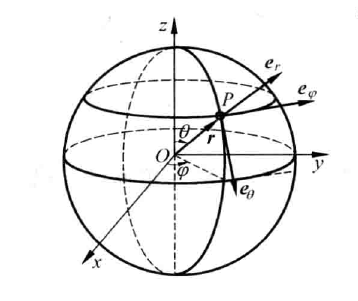

# 向量空间

## 子空间(subspace)

矩阵的四个基本子空间：行空间(row space)、列空间(column space)、零空间(null space)、左零空间(left null space)。

- **行空间：矩阵行向量组成的线性空间，记为$C(A^T)$​​；**
- **列空间：矩阵列向量组成的线性空间，记为$C(A)$；**
- **零空间：表达式$Ax=0$​的解向量组成的线性空间，记为$N(A)$​；**
- **左零空间：表达式$A^Tx=0$​​​的解向量组成的线性空间，记为$N(A^T)$​​​​​​​。**

当$m\times n$​阶矩阵A的秩$rank(A)=r$​,可以通过高斯消元法得到：
$$
\begin{aligned}
A\vec x=\bold 0 &\rArr
\left[\begin{matrix}
I&F\\
\bold 0&\bold 0
\end{matrix}\right]
\vec x=\bold 0 

\\&\rArr \vec x=
\left[\begin{matrix}
-F\\I  
\end{matrix}\right]
\end{aligned}
$$

矩阵的行空间与零空间的维数之和为矩阵的列数$n$​，并且两个子空间相互正交:
$$
dim(C(A^T))+dim(N(A))=n\\
C(A^T)\cdot N(A)=0
$$
矩阵的列空间与左零空间维数之和为矩阵的行数$m$，并且两个子空间相互正交：
$$
dim(C(A))+dim(N(A^T))=m\\
C(A)\cdot N(A^T)=0
$$

<iframe src=https://www.bilibili.com/video/BV1bb411H7JN?p=16
        name="超赞的线性代数讲义"
        class="iframe"
        width=100% 
        height=600px
        scrolling="auto"
        sandbox="allow-scripts allow-forms allow-same-origin">
</iframe>

## 投影矩阵

向量投影变换是指向量在矩阵列空间上的投影，记投影变换矩阵为$P$​​​​​​，即投影变换为:$\boldsymbol b\rightarrow P\boldsymbol b$​​​​​​。记向量$\boldsymbol b$​​​​​​在矩阵$A$​​​​​​的列空间上的投影为$\boldsymbol p$​​​​​​，那么二者的差向量$\boldsymbol b-\boldsymbol p$​​​​​​就应当垂直于投影$\boldsymbol p$​​​​​​​(投影的定义，这样保证投影向量是“最小的”)，所以就有表达式：
$$
\boldsymbol p\cdot(\boldsymbol b-\boldsymbol p)=\boldsymbol 0
\Rightarrow (P\boldsymbol b)^T\cdot(\boldsymbol b-P\boldsymbol b)=\boldsymbol 0
$$

显然从上面的表达式中无法求得$P$​​，再补充一条件，投影$\boldsymbol p$​​在矩阵的矩阵$A$​​的列空间上(投影$\boldsymbol p$​​可以由矩阵$A$​​的列向量线性组合而来)，即满足：
$$
\boldsymbol p=A\hat{\boldsymbol x}
$$
代入式中，然后我们就能够得到：
$$
A^T(\boldsymbol b-A\hat{\boldsymbol x})=\boldsymbol 0
\Rightarrow A^T A\hat{\boldsymbol x}=A^T\boldsymbol b
$$

实际上我们可以这么来理解：差向量$\boldsymbol b-\boldsymbol p=\boldsymbol b-A\hat{\boldsymbol x}$垂直于矩阵$A$的列空间，就可以直接得到上式。当矩阵$A$的列线性无关时，对上面的表达式化简，我们就可以得到投影变换为：
$$
\boldsymbol p=A(A^T A)^{-1}A^T\boldsymbol b
$$
其中，矩阵$P=A(A^T A)^{-1}A^T$​就是投影矩阵。显然，当矩阵的列空间是一条直线时，也是满足投影变换的，这时候我们就有：
$$
\boldsymbol p=\boldsymbol a\hat x=\frac{\boldsymbol a\boldsymbol a^T}{\boldsymbol a^T\boldsymbol a}\boldsymbol b
$$

## 旋转矩阵

记平面向量关于坐标原点旋转$\theta$​角后的旋转变换为：$\boldsymbol b\rightarrow Q\boldsymbol b$​​​。

取坐标系下一组单位基：$\boldsymbol u=[1,0]^T$​​和$\boldsymbol v=[0,1]^T$​​，很容易得到旋转之后在原坐标系下变为：$\boldsymbol u'=[\cos\theta,\sin\theta]^T$​​和$\boldsymbol v=[-\sin\theta,\cos\theta]^T$​。设旋转矩阵为$Q$，那么，就有：​​​​
$$
Q\left[\begin{matrix}
\boldsymbol u&\boldsymbol v
\end{matrix}\right]
=\left[\begin{matrix}
\boldsymbol u'&\boldsymbol v'
\end{matrix}\right]\Rightarrow
Q\left[\begin{matrix}
1&0\\
0&1
\end{matrix}\right]=
\left[\begin{matrix}
\cos\theta&-\sin\theta\\
\sin\theta&\cos\theta
\end{matrix}\right]
$$
即可求矩阵$Q$​得表达式为：

$$
Q=\left[\begin{matrix}
\cos\theta&-\sin\theta\\
\sin\theta&\cos\theta
\end{matrix}\right]
$$

相似地，在三维空间中我们可以得到，绕$x$轴旋转$\alpha$角的旋转矩阵为：
$$
Q_{\alpha}=\left[\begin{matrix}
1&0&0\\
0&\cos\alpha&-\sin\alpha\\
0&\sin\alpha&\cos\alpha
\end{matrix}\right]
$$
绕$y$​轴旋转$\beta$​角的旋转矩阵为：
$$
Q_{\beta}=\left[\begin{matrix}
\cos\beta&0&\sin\beta\\
0&1&0\\
-\sin\beta&0&\cos\beta
\end{matrix}\right]
$$
绕$z$​​轴旋转$\gamma$​​​角的旋转矩阵为：
$$
Q_{\gamma}=\left[\begin{matrix}
\cos\gamma&-\sin\gamma&0\\
\sin\gamma&\cos\gamma&0\\
0&0&1
\end{matrix}\right]
$$
那么三维空间中旋转矩阵可以表示为：
$$
Q=Q_{\alpha}Q_{\beta}Q_{\gamma}
$$

## 反射矩阵

记向量关于直线$l$​​​​​​反射变换矩阵为$P$​​​​​​，即反射变换为：$\boldsymbol b\rightarrow P\boldsymbol b$​​​​​​。取直线$l$​​​​​​上单位方向向量$\boldsymbol u=[\cos\theta,\sin\theta]^T$​​​​​​和单位法向向量$\boldsymbol v=[\sin\theta,-\cos\theta]^T$​​​​​​作为一组基，关于直线$l$​​​​​​对称后的基为$\boldsymbol u'=\boldsymbol u=[\cos\theta,\sin\theta]^T$​​​​​​和$\boldsymbol v'=-\boldsymbol v=[-\sin\theta,\cos\theta]^T$​​​​​​​。就有表达式：
$$
\begin{aligned}
P\left[\begin{matrix}
\boldsymbol u&\boldsymbol v
\end{matrix}\right]=
\left[\begin{matrix}
\boldsymbol u'&\boldsymbol v'
\end{matrix}\right]&\Rightarrow
P\left[\begin{matrix}
\cos\theta&\sin\theta\\
\sin\theta&-\cos\theta\\
\end{matrix}\right]=
\left[\begin{matrix}
\cos\theta&-\sin\theta\\
\sin\theta&\cos\theta\\
\end{matrix}\right]
\\&\Rightarrow
P=\left[\begin{matrix}\cos2\theta&\sin2\theta\\\sin2\theta&-\cos2\theta\end{matrix}\right]
\end{aligned}
$$
那么，平面坐标系下关于直线对称的矩阵变换是：
$$
\begin{bmatrix}
x'\\y'
\end{bmatrix}
=\begin{bmatrix}
\cos2\theta&\sin2\theta\\
\sin2\theta&-\cos2\theta
\end{bmatrix}
\begin{bmatrix}
x\\y
\end{bmatrix}
$$
$P=\begin{bmatrix}\cos2\theta&\sin2\theta\\\sin2\theta&-\cos2\theta\end{bmatrix}$​​​​​​​​也是一个正交矩阵​，满足：(1)$P^{-1}=P^{T}$​​​​​，​(2)$P^2=I$​

