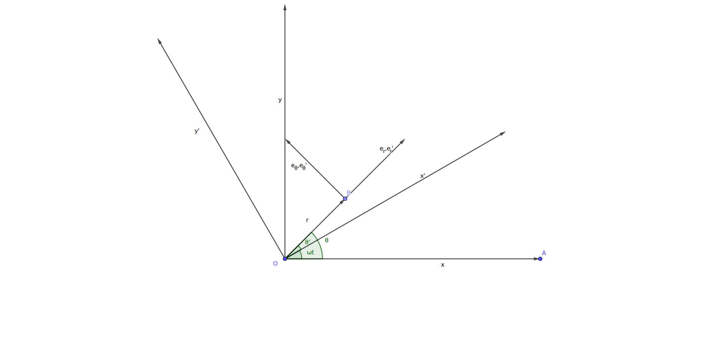

# 科里奥利力

## 平面极坐标运动描述

假设非惯性系$S'$​ 相对于惯性系$S$​以角速度$\omega$​绕$z$​轴旋转,两坐标系原点$O',O$​重合,轴$z',z$​重合。取参考系$S$​的平面$Oxy$​和参考系$S'$​的平面$Ox'y'$​​​​，其相对关系如下图所示。两参考系的时间度量相同，即$t=t'$​​​。

平面极坐标系中，观测点位置可以用矢径来表示，即$\vec r=(r;\theta)$。在参考系$S$和参考系$S'$中,分别取观测点矢径$\vec{r},\vec{r'}$和角矢量$\vec{\theta},\vec{\theta'}$对时间$t$​​​取一阶和二阶微商，有关系式：
$$
\begin{equation}\label{eq1}
\begin{aligned}
r&=r' & \theta &= \theta'+\omega \cdot t\\
\dot r&=\dot{r'} & \dot\theta&=\dot{\theta'}+\omega\\
\ddot r&=\ddot{r'} & \ddot\theta&=\ddot{\theta'}\\
\end{aligned}
\end{equation}
$$
可以看出，在参考系$S$和$S'$​​​中，径向和角向单位矢量相同，即：
$$
\begin{equation} \label{eq2}
\begin{aligned}
\vec{e_{r}}&=\vec{e_{r}'} & \vec{e_{\theta}}&=\vec{e_{\theta}'}\\
\end{aligned}
\end{equation}
$$
上面公式$\ref{eq2}$要说明的一点是，在参考系$S$和$S'$中，径向单位矢量和角向单位矢量虽然相同，但是在不同的参考系中却有着不同的数学形式，即无论是在平面极坐标系下还是平面直角坐标系下，数学表达式不同。实际上，参考系$S'$是由参考系$S$旋转得到的，就是说在数学形式上，参考系$S'$中的物理量可以看成是参考系$S$​​​中的量乘以旋转矩阵得到的。

参考系$S$​中，直角坐标系下，有：
$$
\begin{equation}\label{eq3}
\begin{cases}
\vec{e_r}=\cos\theta\cdot\vec i+\sin\theta\cdot\vec j\\
\vec{e_\theta}=\cos(\theta+\pi/2)\cdot\vec i+\sin(\theta+\pi/2)\cdot\vec j=-\sin\theta\cdot\vec i+\cos\theta\cdot\vec j
\end{cases}
\end{equation}
$$

径向单位矢量$e_r$​和角向单位矢量$e_\theta$​​分别对时间$t$​取微商有：
$$
\begin{equation}\label{eq4}
\begin{cases}
\dot{\vec e_{r}}=\frac{d\vec e_r}{dt}=\frac{d\vec e_r}{d\theta}\frac{d\theta}{dt}=\dot\theta\vec{e_\theta}\\
\dot{\vec e_{\theta}}=\frac{d\vec e_\theta}{dt}=\frac{d\vec e_\theta}{d\theta}\frac{d\theta}{dt}=-\dot\theta\vec{e_r}
\end{cases}
\end{equation}
$$
上面的公式$\ref{eq4}$​​​​​，可以引出一个基本的结论：**基本矢量对时间的微商等于该矢量转动的角速度与自身的叉积**。一个简单的证明如下式$\ref{eq5}$​所示， 观察点如果仅作圆周运动，根据速度的定义有：
$$
\begin{equation}\label{eq5}
\vec v=\frac{d\vec r}{dt}=\dot{\vec\theta}\times\vec r
\end{equation}
$$
可以得到矢径$\vec r$​​​对时间$t$​​​​的一阶微商等于角速度矢量$\dot{\vec\theta}$​​​​与矢径$\vec r$​​​​的叉积。

回到参考系$S$，观测者保持相对静止，对观测点进行观测。其速度矢量$\vec v$和加速度矢量$\vec a$，有：
$$
\begin{equation}\label{eq6}
\begin{aligned}
\vec v=\frac{d\vec r}{dt}=\frac{d(r\vec e_{r})}{dt}=\frac{dr}{dt}\vec{e_{r}}+r\frac{d\vec{e_{r}}}{dt}&=\dot{r}\vec{e_{r}}+r\dot\theta\vec{e_{\theta}}
\\&=\vec{v_r}+\dot{\vec{\theta}}\times\vec{r}
\\&=\vec{v_r}+\vec{v_\theta}
\end{aligned}
\end{equation}
$$

$$
\begin{equation}\label{eq7}
\begin{aligned}
\vec a=\frac{d\vec v}{dt}=\frac{d(\dot r\vec{e_{r}}+r\dot\theta\vec{e_{\theta}})}{dt}
&=\ddot r\vec{e_r}+\dot r\dot\theta\vec{e_{\theta}}+(\dot r\dot\theta+r\ddot\theta)\vec{e_{\theta}}+r\dot\theta(-\dot\theta\vec{e_r})
\\ &=(\ddot r-r\dot\theta^{2})\vec{e_r}+(r\ddot\theta+2\dot r\dot\theta)\vec{e_\theta}
%\\ &=(\dot{\vec{v_r}}+\dot{\vec{\theta}}\times \vec{v})+\ddot{\vec\theta}\times \vec{r}
\\ &=\vec{a_r}+\vec{a_\theta}
\end{aligned}
\end{equation}
$$

在参考系$S'$​​中，观测者保持相对同步运动，对观测点进行观测。同理，其速度矢量$\vec{v'}$​​和加速度矢量$\vec{a'}$​​，有：
$$
\begin{equation}\label{eq8}
\begin{aligned}
\vec{v'}=\frac{d\vec{r'}}{dt}&=\dot{r'}\vec{e'_r}+r'\dot\theta'\vec{e'_\theta}
\\ &=\vec{v_r'}+\dot{\vec{\theta'}}\times \vec{r'}
\\ &=\vec{v_r'}+\vec{v_\theta'}
\end{aligned}
\end{equation}
$$
$$
\begin{equation}\label{eq9}
\begin{aligned}
\vec{a'}=\frac{d\vec{v'}}{dt}&=\frac{d(\dot{r'}\vec{e'_{r}}+r'\dot{\theta'}\vec{e'_{\theta}})}{dt}
\\&=(\ddot{r'}-r'\dot{\theta'^2})\vec{e'_r}+(r'\ddot{\theta'}+2\dot {r'}\dot{\theta'})\vec{e'_\theta}
%\\&=(\dot{\vec{v'_r}}+\dot{\vec{\theta'}}\times \vec{v'})+\ddot{\vec\theta'}\times \vec{r'}
\\&=\vec{a'_r}+\vec{a'_\theta}
\end{aligned}
\end{equation}
$$

将参考系$S'$​​中物理量带入参考系$S$​​中，即对表达式$\ref{eq6}$​​和表达式$\ref{eq7}$​​​中，有：
$$
\begin{equation}\label{eq10}
\begin{aligned}
\vec{v}=\dot{r}\vec{e_{r}}+r\dot\theta\vec{e_{\theta}}&=\dot{r'}\vec{e'_{r}}+r'(\dot\theta'+\omega)\vec{e'_{\theta}}
\\&=(\dot{r'}\vec{e'_{r}}+r'\dot\theta'\vec{e'_{\theta}})+r'\omega\vec{e'_\theta}
\\&=\vec{v'}+\vec{\omega}\times\vec{r'}
\end{aligned}
\end{equation}
$$

$$
\begin{equation}\label{eq11}
\begin{aligned}
\vec{a}&=[\ddot{r'}-r'(\dot\theta'+w)^{2}]\vec{e'_r}+[r'\ddot\theta'+2\dot {r'}(\dot\theta'+w)]\vec{e_\theta'}
\\&=[(\ddot{r'}-r'\dot\theta'^{2})-2r'\dot\theta'w-\omega^2 r']\vec{e'_r}+[(r'\ddot\theta'+2\dot{r'}\dot{\theta'})+2\omega\dot{r'}]\vec{e'_\theta}
\\&=[(\ddot{r'}-r'\dot{\theta'^2})\vec{e'_r}+(r'\ddot{\theta'}+2\dot {r'}\dot{\theta'})\vec{e'_\theta}]-2\omega(r'\dot{\theta'}\vec{e_r}-\dot{r'}\vec{e_\theta})-\omega^2r'\vec{e_r'}
\\&=\vec{a'}-2(\vec{v'_\theta}+\vec{v'_r})\times\vec{\omega}-\omega^2\vec{r'}
\\&=\vec{a'}-2\vec{v'}\times\vec{\omega}-\omega^2\vec{r'}
\end{aligned}
\end{equation}
$$

观测点质量记为$m$,就有：
$$
\begin{equation}\label{eq12}
\begin{aligned}
m\vec{a'}=m\vec{a}+2m\vec{\upsilon'}\vec{\omega}+m\omega^2\vec{r'}
\end{aligned}
\end{equation}
$$
参考系$S$​​中测得观测点真实受力为$\vec F=m\vec a$​​,参考系$S'$​​中就需要引入两个惯性力：惯性离心力$\vec{F_c}=m\omega^2\vec{r'}$​​和科里奥利力$\vec{F_{Cor}}=2m\vec{\upsilon}\vec{\omega}$​​，使得表观力满足：
$$
\vec{F'}=\vec{F}+\vec{F_c}+\vec{F_{Cor}}
$$

## 运动轨迹方程

一般地，力是观测点位置$\vec r$​​，速度$\vec{\upsilon}=\dot r$和时间$t$​的函数，牛顿第二定律的矢量表达式为：

$$
m\ddot{\vec{r}}=\vec F(\vec{r},\vec{\dot r},t)
$$
现在来设想这样一个场景：若质点与参考系$S'$同步运动，在参考系$S$中观测者看来，质点做的是圆周运动，矢径大小始终保持不变，即不存在径向位置的移动，这个时候质点在参考系中$S'$惯性力$\vec{F_{Cor}}=0$​​​，即当质点径向位置不发生变化时，相当于不会产生科里奥利力。

当质点既做圆周运动，又发生径向位置移动时，这样的情况会稍微复杂一点。做一个简单的运动学仿真，示意图如下所示。

## 应用

